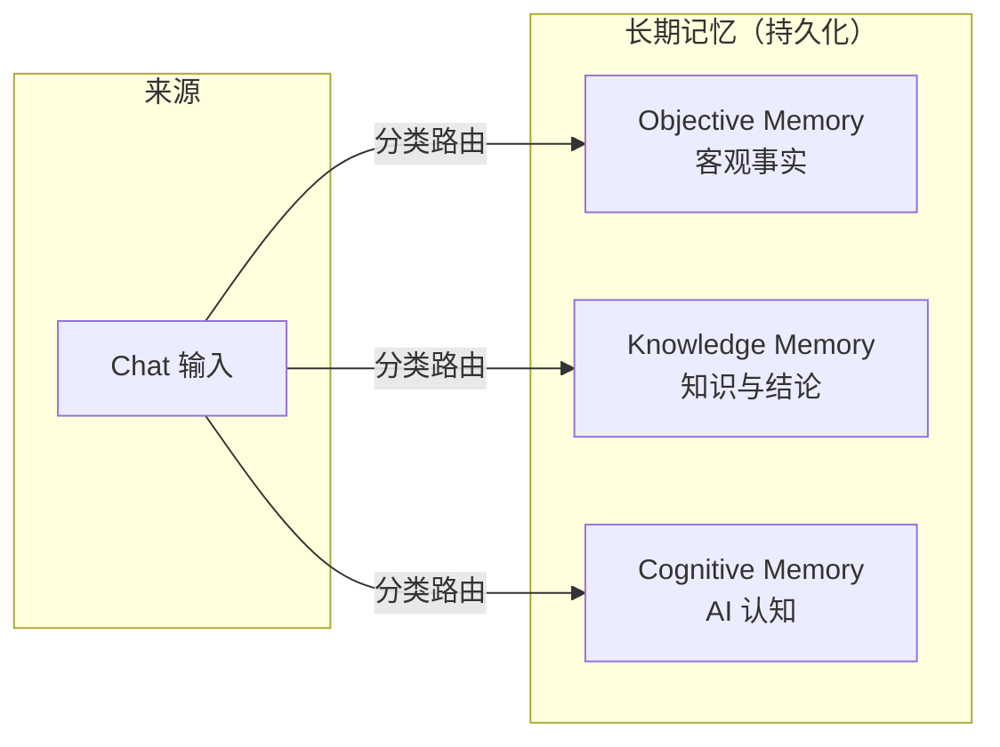
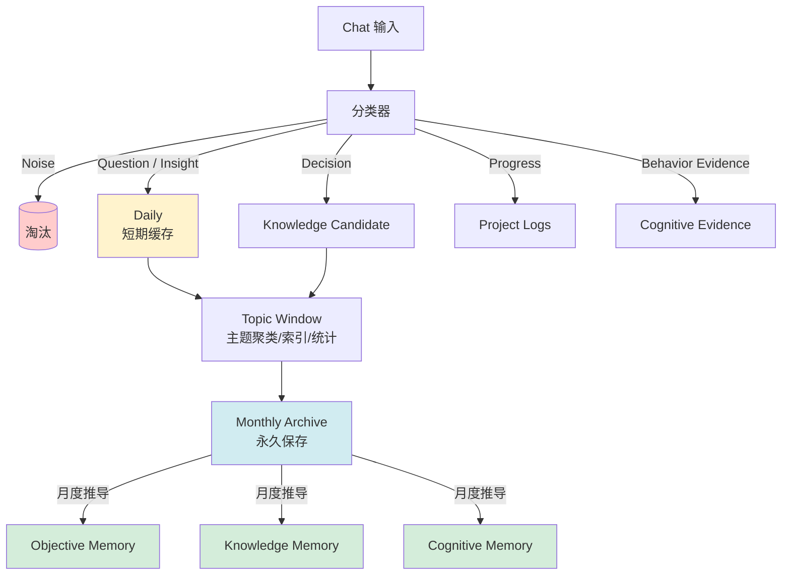
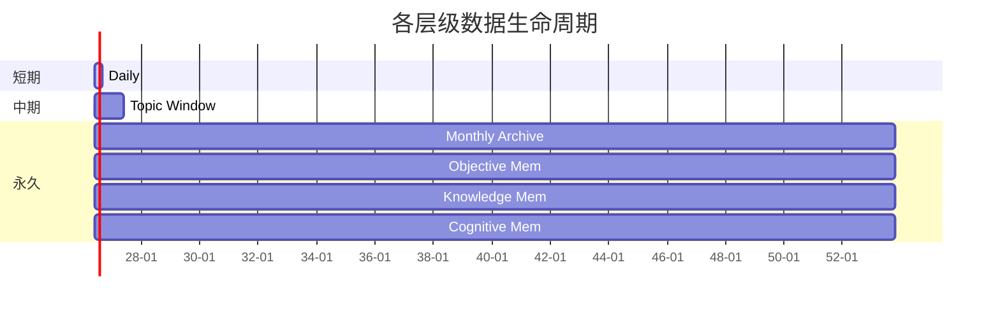
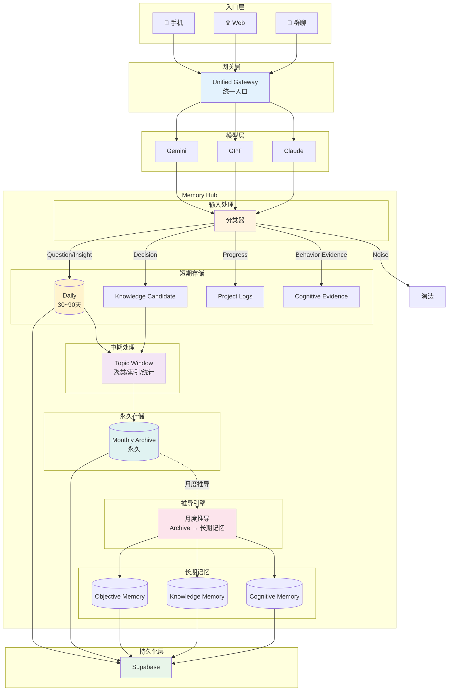

# Personal AI Memory Hub — 系统设计文档

> **版本**: 1.0  
> **日期**: 2026-06-18  
> **状态**: 已确认  
> **作者**: 系统架构组

---

## 1. 项目目标

构建长期运行的个人 AI 中枢。

### 核心原则

| # | 原则 | 说明 |
|---|------|------|
| 1 | 记忆独立于模型 | 记忆数据结构不与任何特定模型绑定 |
| 2 | 模型可替换 | 可在 Gemini / GPT / Claude 等之间切换 |
| 3 | 长期记忆云端保存 | 以 Supabase 为持久化后端 |
| 4 | 手机作为主要入口 | 移动端体验优先 |
| 5 | 低成本优先 | 控制推理与存储成本 |
| 6 | 长期可维护优先 | 架构简洁、可演进 |

---

## 2. 基础架构

```
┌──────────┐
│  手机     │  ← 主要交互入口
└────┬─────┘
     │
     ▼
┌──────────────────┐
│  统一入口         │  ← 群聊 / Web
│  (Unified Gateway)│
└────┬─────────────┘
     │
     ▼
┌──────────────────┐
│  AI 模型层        │  ← Gemini / GPT / Claude 等
│  (Model Layer)   │     模型可替换，不绑定记忆结构
└────┬─────────────┘
     │
     ▼
┌──────────────────┐
│  Memory Hub      │  ← 记忆分类、演化、存储
│  (核心引擎)       │
└────┬─────────────┘
     │
     ▼
┌──────────────────┐
│  Supabase        │  ← 长期持久化存储
└──────────────────┘
```

**关键约束**：Memory Hub 不依赖具体模型。模型仅负责输入处理与推理，记忆的结构化、分类、演化均由 Memory Hub 自身完成。

---

## 3. Memory Hub 设计原则

### 3.1 原则一：记忆不是聊天记录堆积

记忆是经过提炼的结构化数据，而非原始对话日志的简单存储。

### 3.2 原则二：记录结论，不记录研究过程

仅保存最终结论与决策，过程性内容通过 Monthly Archive 保留原始数据。

### 3.3 原则三：默认淘汰，而不是默认保留

未经分类确认的信息默认不进入长期记忆。

### 3.4 原则四：长期记忆的标准

> **"未来会被反复引用的信息"** 才值得进入长期记忆。

### 3.5 原则五：记忆独立于模型

模型升级后，应能利用新能力对历史数据进行重新分析与理解。

---

## 4. 记忆类型体系

> **注意**：本节定义的"记忆类型"是**宏观分类视角**，用于描述记忆内容的性质。  
> 在数据建模层面（参见 `03_Entity_MemoryGraph.md`），这些内容被实现为 MemoryNode 的不同 Level（L1 Observation → L2 Pattern → L3 Belief → L4 State）。两者是同一概念的不同抽象层级。

### 4.1 概览



### 4.2 Objective Memory（客观事实）

**定义**：可验证的客观事实。

| 属性 | 说明 |
|------|------|
| 可验证 | 可通过外部证据核实 |
| 可证伪 | 存在被证明为假的可能 |
| 可更新覆盖 | 新证据可覆盖旧记录 |

**示例**：

- 用户居住在日本
- 用户有女儿
- 用户使用 Struts 项目

**数据映射**：在 MemoryNode 模型中对应 **L1: Observation**。

### 4.3 Knowledge Memory（知识与结论）

**定义**：经过确认的知识与决策结论。

**示例**：

- 采用 Supabase 作为 Memory Hub 候选方案
- Hermes 作为执行层
- Supabase pgvector 作为向量检索方案（MVP）

**数据映射**：在 MemoryNode 模型中对应 **L2: Pattern** 或 **L4: State**。

### 4.4 Cognitive Memory（AI 认知）

**定义**：AI 基于交互形成的对用户行为模式、偏好、倾向的认知。

| 属性 | 说明 |
|------|------|
| 非事实 | 不是客观事实，是概率性判断 |
| 允许纠偏 | 用户可随时纠正 |
| 动态置信度 | 基于证据动态调整 |

**示例**：

- 用户倾向先 POC 后投入开发
- 用户长期关注维护成本

**数据映射**：在 MemoryNode 模型中对应 **L3: Belief**。

---

## 5. 记忆演化架构



**流程说明**：

1. **Chat 输入** → 进入分类器
2. **分类** → 按标签分流至不同处理管道
3. **Daily** → 短期缓存（30~90 天），支持主题聚类
4. **Topic Window** → 主题聚类、索引、频率统计，不产生长期结论
5. **Monthly Archive** → 月度归档，永久保存，是所有长期记忆的原始母体
6. **月度推导** → 从 Archive 中提取结构化记忆，写入三类长期记忆

---

## 6. Chat 分类体系

### 6.1 分类标签

| 标签 | 含义 | 路由目标 |
|------|------|----------|
| `Noise` | 无价值信息 | 直接淘汰 |
| `Question` | 问题 | Daily |
| `Insight` | 洞察 | Daily |
| `Decision` | 决策 | Knowledge Candidate |
| `Progress` | 进展 | Project Logs |
| `Behavior Evidence` | 行为证据 | Cognitive Evidence |

### 6.2 多标签支持

单条消息可拥有多个标签，例如一条消息可同时标记为 `Question` + `Insight`。

---

## 7. Topic Window 设计

### 7.1 定位

Topic Window **不是**总结层。

### 7.2 作用

| 功能 | 说明 |
|------|------|
| 主题聚类 | 将相似话题归组 |
| 主题索引 | 建立话题的可检索索引 |
| 统计频率 | 记录话题出现频次 |

### 7.3 约束

- 不产生长期结论
- 可随时重建（无状态）

---

## 8. Monthly Archive 设计

### 8.1 定位

Monthly Archive 是**所有长期记忆的原始母体**。

### 8.2 永久保存的原因

1. 未来模型能力提升后，可重新分析历史记录
2. 长期记忆的推导基础，不可丢失
3. 提供完整的上下文回溯能力

### 8.3 内容

- 当月所有经过分类的消息
- 分类标签与路由结果
- 生成的 Topic Window 数据

---

## 9. 生命周期设计



| 层级 | 保留周期 | 说明 |
|------|----------|------|
| Daily | 30~90 天 | 短期缓存，过期自动清理 |
| Topic Window | 约 1 年 | 可重建，非关键数据 |
| Monthly Archive | 永久保存 | 长期记忆的原始母体 |
| Objective Memory | 永久保存 | 客观事实，可更新覆盖 |
| Knowledge Memory | 永久保存 | 知识结论，可更新覆盖 |
| Cognitive Memory | 永久保存 | 允许动态修正置信度 |

---

## 10. Memory Hub 总体架构图



---

## 11. 数据流总结

```
用户输入 → 统一入口 → AI 模型处理 → 分类器打标
                                              ├→ Noise      → 淘汰
                                              ├→ Question   → Daily
                                              ├→ Insight    → Daily
                                              ├→ Decision   → Knowledge Candidate
                                              ├→ Progress   → Project Logs
                                              └→ Behavior   → Cognitive Evidence
                                                        ↓
                                                   Daily → Topic Window
                                                        ↓
                                                   Monthly Archive（永久）
                                                        ↓
                                                   月度推导 → 三类长期记忆
                                                        ↓
                                                   Supabase 持久化
```

---

## 附录 A：术语表

| 术语 | 全称 | 说明 |
|------|------|------|
|| Workspace | 顶层容器，支持单用户/家庭/团队场景（参见 04） |
|| MemoryNode | 记忆节点，通过 Level 区分类型（L1-L4）（参见 03/04） |
|| Reflect | 认知分析任务（参见 04/08） |
|| Archive | 认知压缩层，不是冷存储（参见 04） |
|| vector_documents | 独立向量层，存储高价值内容的 embedding（参见 04） |
|| Ingestion Engine | 接收 Conversation，输出 Observation（参见 06 第 3.2 章） |
|| Reflection Engine | 执行 Reflection Workflow，输出 Pattern/Belief（参见 06 第 3.3 章） |
|| Activation Engine | 执行 State Activation，输出运行时 State（参见 06 第 3.4 章） |
|| Retrieval Engine | 执行 Vector/Graph/Hybrid 检索（参见 06 第 3.5 章） |
|| Context Builder | 四层 Context 构建（参见 06 第 3.6 章） |
|| Scheduler | 事件驱动 + Cron 驱动的任务调度器（参见 06 第 3.7 章） |
| Daily | Daily Storage | 短期记忆缓存，30~90 天 |
| Topic Window | Topic Window | 主题聚类与索引，约 1 年 |
| Monthly Archive | Monthly Archive | 月度归档，永久保存 |
| Objective Memory | Objective Memory | 客观事实类长期记忆 |
| Knowledge Memory | Knowledge Memory | 知识与结论类长期记忆 |
| Cognitive Memory | Cognitive Memory | AI 认知类长期记忆 |

---

## 附录 B：文档变更记录

| 版本 | 日期 | 变更说明 | 状态 |
|------|------|----------|------|
| 1.3 | 2026-06-20 | Review 06 修订：附录 A 术语表补充 Ingestion/Reflection/Activation/Retrieval/Context Builder/Scheduler 六个 Engine 术语 | ✅ 已确认 |

---

*本文档仅记录已达成共识的设计决策，未涉及的内容不在本文档范围内。*
