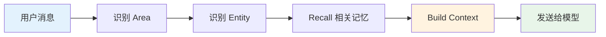
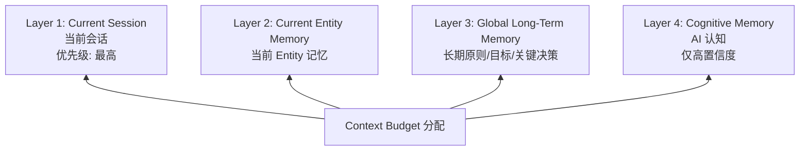
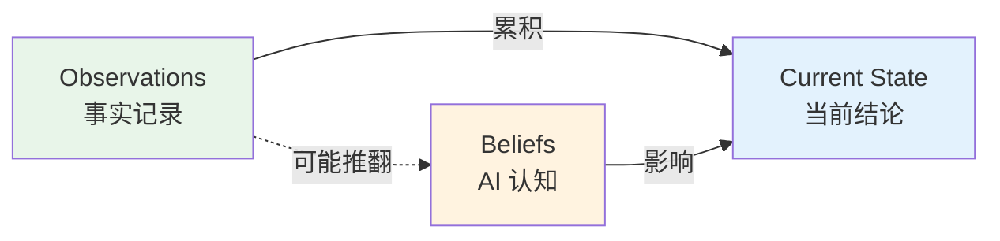
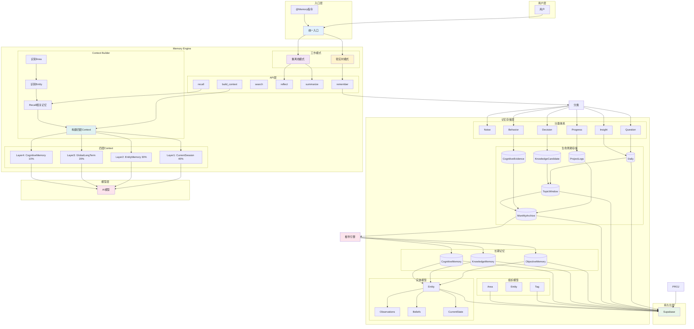

# Personal AI Memory Hub — Memory Engine 与 Context Builder 设计文档

> **版本**: 1.0  
> **日期**: 2026-06-18  
> **阶段**: 第二阶段  
> **状态**: 已确认  
> **作者**: 系统架构组

---

## 1. 设计目标

Memory Engine 是个人 AI 平台的长期记忆基础设施。

### 核心目标

| # | 目标 | 说明 |
|---|------|------|
| 1 | 记忆独立于模型 | 记忆结构与具体 AI 模型解耦 |
| 2 | 多模型共享记忆 | Gemini / GPT / Claude / Qwen 可共享同一记忆库 |
| 3 | 长期演化 | 支持记忆随时间自然生长与淘汰 |
| 4 | 认知纠偏 | AI 认知支持动态修正与置信度调整 |
| 5 | 历史可重分析 | 模型升级后可重新分析历史数据 |

---

## 2. Memory Engine 定位

### 2.1 不是人格

Memory Engine **不是**人格模块，不模拟人格特征。

### 2.2 是基础设施

Memory Engine 是底层记忆基础设施，提供记忆全生命周期管理能力。

### 2.3 职责

| 职责 | 说明 |
|------|------|
| 分类 | 对输入信息进行自动分类 |
| 归档 | 按生命周期规则管理数据存储 |
| 检索 | 语义检索与精准召回 |
| 总结 | 生成 Daily / Topic Window / Monthly Archive |
| 认知更新 | 动态调整 AI 认知的置信度 |
| 上下文构建 | 将记忆转换为模型可用的 Prompt Context |

---

## 3. 混合工作模式

Memory Engine 采用双模式工作，兼顾实时性与深度处理能力。

### 3.1 轻实时模式

**触发条件**：特定类型事件即时进入 Ingestion Pipeline。

**处理内容**：

| 类型 | 说明 | 示例 |
|------|------|------|
| Decision | 用户明确决策 | "决定采用 Supabase" |
| Objective Fact | 客观事实记录 | "用户居住在日本" |
| Explicit Memory Command | 用户显式记忆指令 | `@Memory 记住某条信息` |

**行为**：立即进入 Ingestion Pipeline（Chunking → Extraction → Entity Linking → Validation → Observation Store），经 Scoring Engine 评分后持久化。参见 06 第 3.2 章。

### 3.2 重离线模式

**触发条件**：定时执行，不阻塞用户交互。

**处理内容**：

| 任务 | 产出 |
|------|------|
| Daily 生成 | 当日记忆摘要 |
| Topic Window 生成 | 主题聚类与索引 |
| Monthly Archive 生成 | 月度归档 |
| Cognitive Analysis 生成 | 认知分析与置信度更新 |

---

## 4. Memory Engine API

### 4.1 remember()

**功能**：记录新信息到记忆系统。

**输入**：原始信息（文本）

**Memory Engine 负责**：

```
remember(input)
  ├→ 分类（Classification）
  ├→ 归属（Assignment）
  ├→ 评分（Scoring）
  └→ 存储（Persistence）
```

### 4.2 recall()

**功能**：取回与当前上下文相关的记忆。

**输入**：上下文查询

**输出**：相关记忆列表（按相关性排序）

### 4.3 search()

**功能**：语义检索。

**输入**：搜索查询

**输出**：匹配的记忆条目

### 4.4 reflect()

**功能**：认知分析。

**输出**：

| 输出项 | 说明 |
|--------|------|
| 长期偏好 | 用户稳定的偏好模式 |
| 行为模式 | 用户的行为习惯与倾向 |
| 稳定倾向 | 跨时间验证的稳定特征 |

### 4.5 summarize()

**功能**：生成各层级记忆摘要。

**输出**：

| 摘要类型 | 说明 |
|----------|------|
| Daily | 当日记忆摘要 |
| Topic Window | 主题聚类与索引 |
| Monthly Archive | 月度归档 |

### 4.6 build_context()

**功能**：构建模型上下文。

**作用**：将记忆转换为 Prompt Context，供 AI 模型使用。

---

## 5. Context Builder 设计

### 5.1 职责

Context Builder 负责将 Memory Engine 中的记忆转换为模型可用的 Prompt 上下文。

### 5.2 核心原则

> **不要把全部记忆注入模型。**  
> **只注入当前最相关记忆。**

### 5.3 工作流



**流程说明**：

1. **用户消息** → 进入 Context Builder
2. **识别 Area** → 确定用户消息所属的一级领域
3. **识别 Entity** → 确定当前 Entity（Project 也作为 Entity 存储，参见 04）
4. **Recall 相关记忆** → 从 Memory Engine 召回相关记忆
5. **Build Context** → 按四层结构构建上下文
6. **发送给模型** → 注入 Prompt 供模型使用

---

## 6. Context 四层结构

### 6.1 概览



### 6.2 Layer 1 — Current Session

| 属性 | 说明 |
|------|------|
| 内容 | 最近会话内容 |
| 优先级 | 最高 |
| 范围 | 当前对话窗口内的上下文 |

### 6.3 Layer 2 — Current Entity Memory

| 属性 | 说明 |
|------|------|
| 内容 | 当前 Entity 相关记忆 |
| 优先级 | 高 |
| 范围 | 与当前 Entity 直接相关的记忆（Project 也作为 Entity 存储，参见 04） |

### 6.4 Layer 3 — Global Long-Term Memory

| 属性 | 说明 |
|------|------|
| 内容 | 长期原则、长期目标、关键决策 |
| 优先级 | 中 |
| 范围 | 全局适用的重要记忆 |

### 6.5 Layer 4 — Cognitive Memory

| 属性 | 说明 |
|------|------|
| 内容 | AI 形成的认知 |
| 优先级 | 低 |
| 注入条件 | **仅注入高置信度认知** |

---

## 7. Context Budget 原则

### 7.1 推荐分配

| 层级 | 预算占比 | 说明 |
|------|----------|------|
| Layer 1 | 40% | 当前会话，最重要 |
| Layer 2 | 30% | Entity 相关，次重要 |
| Layer 3 | 20% | 全局长期记忆 |
| Layer 4 | 10% | AI 认知，最低 |

### 7.2 设计意图

> 避免认知偏见压制事实。

通过限制 Cognitive Memory 的注入比例，确保模型以事实为基础进行推理，而非被 AI 的历史认知所主导。

---

## 8. Area → Project → Memory 模型

### 8.1 最终确定

> **注意**：顶层结构已升级为 `Workspace → User → Area → Project → Entity`（参见 `03_Entity_MemoryGraph.md` ADR-006）。  
> 本节描述的是 Workspace 之下的子结构。

```
Workspace
  └─ User
       └─ Area（一级实体，必需）
            └─ Project（二级实体，可选）
                 └─ Entity（记忆载体）
```

### 8.2 层级关系

| 层级 | 名称 | 是否必需 | 说明 |
|------|------|----------|------|
| Level 1 | Area | ✅ 必需 | 一级领域划分（隶属于 User） |
| Level 2 | Project | ⚠️ 可选 | 二级项目划分（隶属于 Area） |
| Level 3 | Entity | ✅ 必需 | 记忆载体（隶属于 Project 或直接隶属于 Area） |

### 8.3 Area 示例

| Area | 说明 |
|------|------|
| AI | 人工智能相关 |
| Work | 工作相关 |
| Family | 家庭相关 |
| Finance | 财务相关 |
| Health | 健康相关 |
| Learning | 学习相关 |

### 8.4 Project 示例

```
AI
├── Furigana
├── Personal AI Platform
├── Eidos 研究
└── AI 直播

Finance
├── NISA
├── 青色申告
└── 副业
```

---

## 9. Tag 设计

### 9.1 定位

Tag 用于**横向关联**，跨越 Area 与 Project 的层级边界。

### 9.2 用途

Tag 标记技术栈、工具、概念等跨领域元素。

### 9.3 示例

| Tag | 说明 |
|-----|------|
| Supabase | 数据库/后端服务 |
| Hermes | 执行层框架 |
| pgvector | 向量检索（Supabase 内置） |
| MemoryHub | 记忆系统本身 |

### 9.4 特性

- 可跨 Area 与 Project 关联
- 同一 Tag 可应用于多条记忆
- 支持多维度检索

---

## 10. Memory Entity 模型

### 10.1 核心原则

> Memory 以 **Entity** 为核心组织单元。

> **注意**：Entity 的内部结构在 `03_Entity_MemoryGraph.md` 中进一步定义为 MemoryNode（L1 Observation → L2 Pattern → L3 Belief → L4 State）+ Relationship。本节描述的是概念层面的组成。

### 10.2 Entity 组成（概念层）

```
Entity
├── Observations（观察记录）→ 对应 MemoryNode L1
├── Beliefs（AI 认知）→ 对应 MemoryNode L3
└── Current State（当前状态）→ 对应 MemoryNode L4
```

> Pattern（L2）在概念层隐含于 Observation → Belief 的推导过程中，在数据模型中作为独立的 MemoryNode Level 存在。

### 10.3 三者关系



| 组件 | 性质 | 说明 |
|------|------|------|
| Observations | 事实 | 记录发生过的事情，保留历史 |
| Beliefs | 认知 | AI 基于观察形成的推断，允许长期纠偏 |
| Current State | 结论 | 由 Observations 与 Beliefs 共同推导得出 |

### 10.4 Observation

**定义**：记录发生过的事实。

**特性**：

- 保留历史，不可删除
- 可被新证据补充或修正
- 是 Current State 的基础

### 10.5 Belief

**定义**：AI 基于观察形成的认知。

**结构**：

```json
{
  "belief": "用户倾向先POC后投入开发",
  "confidence": 0.8,
  "support_count": 3,
  "support_entities": ["ent_001", "ent_002"],
  "support_areas": ["area_ai", "area_work"],
  "support_evidence": ["observation_001", "observation_002", "observation_003"],
  "contradict_evidence": []
}
```

> 注意：`support_count` / `support_entities` / `support_areas` 在 05 中明确为必须字段（参见 Evidence Model）。

**特性**：

- 非事实，是概率性判断
- 允许长期纠偏
- 置信度可动态调整

### 10.6 Current State

**定义**：实体的当前状态结论。

**推导逻辑**：

```
State = Belief + Current Context
```

> **注意**：State 不是独立的持久化实体，而是 Belief 在当前上下文中的运行时激活结果（参见 05 第 12 章）。

- 由 Belief 结合当前上下文动态计算
- 随上下文变化而调整
- 代表实体在当前时刻的最新认知状态

---

## 11. Memory Engine 总体架构图



---

## 12. 数据流总结

```
用户输入 → 统一入口
              ├→ 轻实时模式 → remember() → 分类 → 存储
              └→ 重离线模式 → summarize()/reflect() → 归档/认知更新

上下文构建：
用户消息 → Retrieval Engine → Activation Engine → Context Builder → LLM（参见 06 第 11.1 章）

记忆存储：
Entity = Observations + Beliefs + State（State = Belief + Current Context，参见 05 第 12 章）
组织模型：User → Area → Entity（顶层为 Workspace，参见 03）
横向关联：Tag（跨 Area）+ Relationship（图边）+ Evidence Links（跨 Level）
```

---

## 13. 与第一阶段设计的关系

| 维度 | 第一阶段（骨架） | 第二阶段（Engine + Context） |
|------|------------------|------------------------------|
| 关注点 | 记忆类型、生命周期、分类体系 | API 设计、上下文构建、实体模型 |
| 记忆类型 | Objective / Knowledge / Cognitive<br/>（宏观分类，参见 01） | Entity = Observations + Beliefs + Current State<br/>（数据模型，参见 03 MemoryNode Level） |
| 架构层次 | 入口 → Hub → Supabase | 入口 → Engine API → Context Builder → 模型 |
| 上下文 | 未涉及 | 四层结构 + Context Budget |
| 组织模型 | 未涉及 | Area → Project → Memory + Tag |

---

## 附录 A：术语表

| 术语 | 说明 |
|------|------|
| Memory Engine | 记忆分类、归档、检索、总结、认知更新、上下文构建的核心引擎 |
| Context Builder | 将记忆转换为 Prompt Context 的组件（含 Ranker/Compressor/Assembler 模块，参见 06 第 10.3 章） |
| Ingestion Engine | 接收 Conversation，输出 Observation（参见 06 第 3.2 章） |
| Reflection Engine | 执行 Reflection Workflow，输出 Pattern/Belief（参见 06 第 3.3 章） |
| Activation Engine | 执行 State Activation，输出运行时 State（参见 06 第 3.4 章） |
| Retrieval Engine | 执行 Vector/Graph/Hybrid 检索（参见 06 第 3.5 章） |
| Scheduler | 事件驱动 + Cron 驱动的任务调度器（参见 06 第 3.7 章） |
| Area | 一级领域实体（AI / Work / Family 等） |
| Project | 二级项目实体（可选，隶属于 Area） |
| Entity | 记忆的核心组织单元，包含 MemoryNode（L1-L4）和 Relationship（参见 03） |
| Observation | 事实记录，保留历史，对应 MemoryNode L1 |
| Belief | AI 认知，支持置信度与纠偏，对应 MemoryNode L3 |
| Current State | 实体当前结论，由 Observation 与 Belief 推导，对应 MemoryNode L4 |
| Tag | 横向关联标签，跨 Area 与 Project |
| Context Budget | 四层上下文的 token 分配比例 |
| Workspace | 顶层容器，支持单用户/家庭/团队场景（参见 04） |
| MemoryNode | 记忆节点，通过 Level 区分类型（L1-L4）（参见 03/04） |
| Reflect | 认知分析任务，负责思考；Archive 负责总结（参见 04） |
| Archive | 认知压缩层，不是冷存储（参见 04） |
| vector_documents | 独立向量层，存储高价值内容的 embedding（参见 04） |

---

## 附录 B：文档变更记录

| 版本 | 日期 | 变更说明 | 状态 |
|------|------|----------|------|
| 1.5 | 2026-06-20 | Review 06 修订：(1) 术语表补充 Ingestion/Reflection/Activation/Retrieval/Context Builder/Scheduler 六引擎术语 | ✅ 已确认 |

---

*本文档仅记录已达成共识的设计决策，未涉及的内容不在本文档范围内。*
