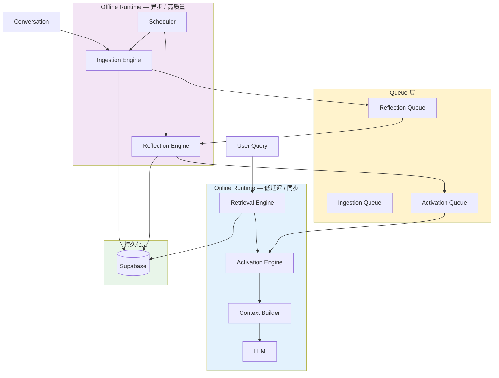
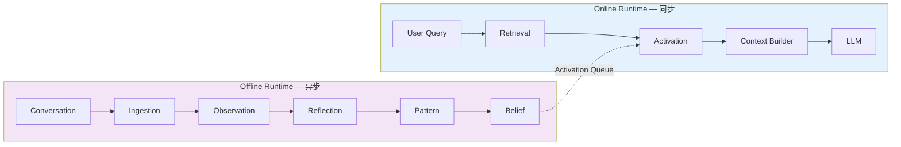
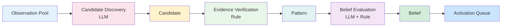
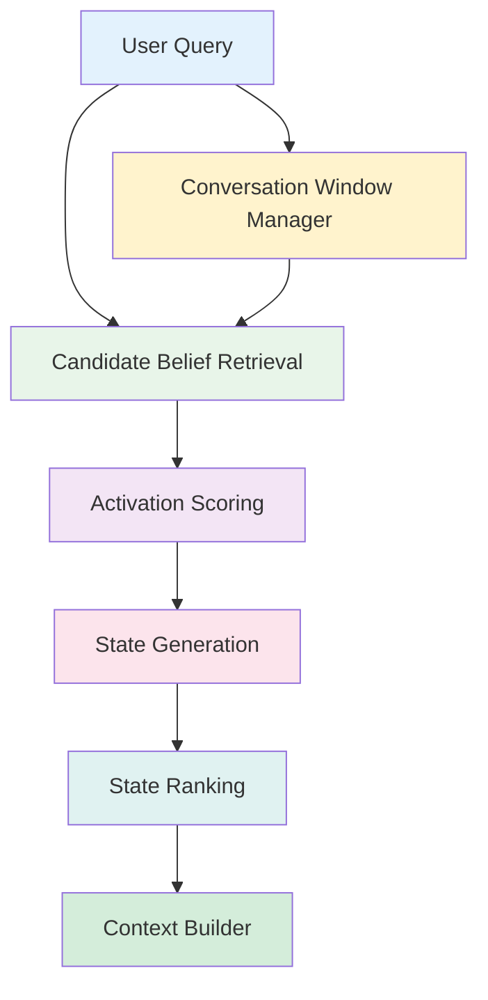
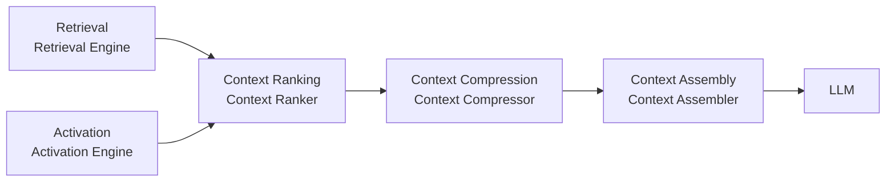
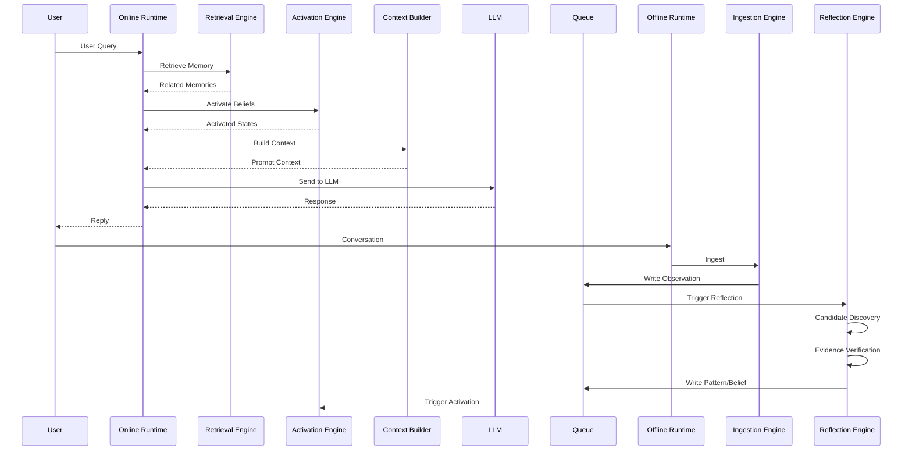

# Personal AI Memory Hub — Runtime Architecture 设计文档

> **版本**: 1.0
> **日期**: 2026-06-20
> **阶段**: 第六阶段
> **状态**: 已确认
> **作者**: 系统架构组

---

## 1. 设计目标

Runtime Architecture 定义 Memory Hub 的运行时系统架构，明确以下核心问题：

* Online 路径与 Offline 路径的职责划分
* 各 Engine 的边界与协作关系
* Sync / Async 边界
* Queue 架构与生命周期
* Scheduler 架构
* LLM vs Rule 的职责边界
* Reflection 与 Activation 的完整流程
* Context Builder 的内部模块

### 1.1 Runtime 目标

Memory Hub 运行时系统负责两条核心路径：

**Online Path（同步）**：

```
User Query
  ↓
Memory Retrieval
  ↓
State Activation
  ↓
Context Construction
  ↓
LLM
```

**Offline Path（异步）**：

```
Conversation
  ↓
Memory Ingestion
  ↓
Reflection
  ↓
Memory Evolution
```

---

## 2. Runtime 分层架构

### 2.1 两层模型

Runtime 分为两层，职责严格分离：

| 层 | 名称 | 职责 | 特点 |
|----|------|------|------|
| Online Runtime | 在线运行时 | Retrieval Engine、Activation Engine、Context Builder、LLM | 低延迟、同步执行 |
| Offline Runtime | 离线运行时 | Ingestion Engine、Reflection Engine、Scheduler | 异步执行、高质量 |

### 2.2 分层原则

* Online Runtime 保证响应延迟，不执行耗时操作。
* Offline Runtime 保证处理质量，不阻塞用户请求。
* 两层通过 Queue 和 Event 机制通信，不直接共享内存。

### 2.3 Runtime 总体架构图



---

## 3. Runtime Engine 定义

### 3.1 Engine 清单

> **Phase B 重新定义**：Engine 代表**领域能力（Domain Capability）**，不是 Agent、不是 Service、不是 Repository。
> Engine 必须是：无状态、可复用、能力导向。Composite Engine 可组合 Atomic Engine。

Runtime 由 8 个核心 Engine 构成：

| # | Engine | 所属层 | 职责 |
|---|--------|--------|------|
| 1 | Ingestion Engine | Offline | 接收 Conversation，输出 Observation |
| 2 | Reflection Engine | Offline | 接收 Observation，输出 Pattern / Belief |
| 3 | Activation Engine | Online | 接收 Belief + Context，输出 State |
| 4 | Retrieval Engine | Online | 接收 Query，输出相关记忆 |
| 5 | Context Builder | Online | 接收检索结果 + State，输出 Prompt Context |
| 6 | Scheduler | Offline | 事件驱动 + Cron 驱动的任务调度 |
| 7 | EntityEngine | Domain | 身份管理（Resolution / Merge / Alias / Canonical Name） |
| 8 | RelationshipEngine | Domain | 图关系管理（Entity 间关系维护） |
| 9 | TaskRuntime | Infrastructure | 通用任务调度与执行基础设施 |

### 3.2 Ingestion Engine

**职责**：执行 Memory Ingestion Pipeline（参见 05 第 4 章）。

**输入**：原始 Conversation 消息。

**输出**：

| 输出项 | 说明 |
|--------|------|
| Observation | 写入 `memory_nodes` 表（level = L1） |
| Entity | 若 Extraction 阶段发现新 Entity，创建记录 |
| Relationship | 建立 Entity 间的关联关系 |
| Reflect Task | 触发 Reflection Engine 处理 |

**内部阶段**：

1. **Chunking** — 将长消息拆分为语义完整的片段
2. **Extraction** — 从 Chunk 中提取潜在事实陈述
3. **Entity Linking** — 将 Observation 关联到正确的 Entity
4. **Validation** — 验证 Observation 是否符合写入标准，计算三套评分
5. **Observation Store** — 将 Observation 持久化到 Memory Store

**约束**：

* Ingestion Engine 必须在 Conversation 结束后尽快执行。
* 执行结果进入 Ingestion Queue，由 Scheduler 调度处理。
* 不阻塞用户交互。

### 3.3 Reflection Engine

**职责**：执行 Reflection Workflow（参见 05 第 11 章）。

**输入**：Observation Pool（来自 Reflect Queue）。

**输出**：

| 输出项 | 说明 |
|--------|------|
| Pattern | 写入 `memory_nodes` 表（level = L2） |
| Belief | 写入 `memory_nodes` 表（level = L3） |

**内部阶段**：

1. **Candidate Discovery** — 语义聚类，生成候选 Pattern（LLM）
2. **Evidence Verification** — 验证候选 Pattern 的证据链（Rule）
3. **Pattern Confirmation** — 确认的 Pattern 进入 Belief Evaluation 队列
4. **Belief Evaluation** — 基于 Confirmed Pattern 评估 Belief（LLM + Rule）
5. **Belief Confirmation** — 确认的 Belief 写入持久化存储

**约束**：

* 禁止 Observation → Belief 的直接跳跃。
* 必须经过：Candidate → Pattern → Belief 的完整链路。
* Light Reflect 产生的 Pattern 候选必须标记 `status = 'candidate'`，不进入 vector_documents。

### 3.4 Activation Engine

**职责**：执行 State Activation（参见 05 第 12 章）。

**输入**：

| 输入项 | 说明 |
|--------|------|
| Current Context | 用户当前 Query 和 Conversation Window |
| Entity Belief List | 相关 Entity 的所有已确认 Belief |

**输出**：

| 输出项 | 说明 |
|--------|------|
| State | 运行时激活的 State（不持久化） |

**内部阶段**：

1. **Belief Activation** — 根据当前上下文筛选适用的 Belief
2. **State Generation** — 计算 `State = Belief + Current Context`
3. **State Ranking** — 按匹配度和置信度排序激活的 State

**约束**：

* State 不是持久化实体，是 Belief 在当前上下文中的运行时激活结果。
* State 的激活不通过 Reflect，而是通过 Context Builder 的实时计算。
* 激活基于当前 Query、Recent Conversation Window、Active Area Score、Active Entity Score。

### 3.5 Retrieval Engine

**职责**：执行多维记忆检索。

**输入**：用户 Query。

**输出**：相关记忆列表（按相关性排序）。

**内部阶段**：

1. **Vector Search** — 通过 `vector_documents` 表进行语义检索
2. **Graph Search** — 通过 Entity → Relationship → Entity 遍历检索
3. **Hybrid Search** — 合并 Vector 和 Graph 的检索结果

**约束**：

* 遵循"Entity 优先，Graph 优先，Vector 辅助"原则（参见 02）。
* 检索结果由 Context Builder 进行后续排序和压缩。

### 3.6 Context Builder

**职责**：将检索结果和激活的 State 组合为模型可用的 Prompt Context。

**输入**：

| 输入项 | 说明 |
|--------|------|
| Retrieval Results | Retrieval Engine 输出的相关记忆 |
| Activated States | Activation Engine 输出的 State |

**输出**：

| 输出项 | 说明 |
|--------|------|
| Prompt Context | 组装好的 LLM 可用 Context |

**内部模块**：

| 模块 | 职责 |
|------|------|
| Context Ranker | 按优先级排序检索结果 |
| Context Compressor | 压缩冗余内容，控制 Token 用量 |
| Context Assembler | 按四层结构组装最终 Context |

**Context 优先级**：

```
State (L4) > Belief (L3) > Pattern (L2) > Observation (L1)
```

**约束**：

* 必须支持 Token Budget（参见 02 第 7 章）。
* 必须支持 Context Source Trace（参见 04 第 15.4 章）。

### 3.7 Scheduler

**职责**：事件驱动 + Cron 驱动的后台任务调度器。（详见 10_6 §7）

**约束**：

* Scheduler 只负责任务调度，不承担业务逻辑。
* 业务逻辑由各 Service 自行实现。
* Scheduler 是 Task Runtime 的一部分，通过 Task Registry 路由 Domain Event → Task。

**触发模式**：

| 模式 | 说明 | 示例 |
|------|------|------|
| 事件驱动 | 特定事件发生时触发 | Observation Created、Belief Updated、EntityMerged |
| Cron 驱动 | 定时触发（兜底机制） | Archive Cron（V2）、Maintenance Cron（V3） |
| Startup Recovery | 启动恢复崩溃任务 | Running Tasks 恢复为 Pending |
| User Async Request | 用户异步请求 | 用户手动触发 Reflection |

---

## 4. Sync / Async Boundary

### 4.1 核心原则

> 影响当前回答的流程必须同步。
> 不影响当前回答的流程必须异步。

### 4.2 Online Path（同步）

```
User Query
  ↓ [同步]
Retrieval
  ↓ [同步]
Activation
  ↓ [同步]
Context Builder
  ↓ [同步]
LLM
```

**延迟要求**：端到端延迟 ≤ 2 秒（不含 LLM 推理时间）。

### 4.3 Offline Path（异步）

```
Conversation
  ↓ [异步]
Ingestion
  ↓ [异步]
Observation
  ↓ [异步]
Reflection Queue
  ↓ [异步]
Candidate
  ↓ [异步]
Pattern
  ↓ [异步]
Belief
  ↓ [异步]
Activation Queue
```

**延迟要求**：无硬性要求，但应在合理时间内完成处理。

### 4.4 边界示意



---

## 5. Queue Architecture

### 5.1 队列清单

| 队列 | 职责 | MVP | V2 | V3 |
|------|------|-----|----|----|
| tasks（统一任务表） | 管理 INGESTION / REFLECTION / ACTIVATION / ARCHIVE 所有任务 | ✅ | | |

### 5.2 队列通用能力

所有任务类型在 `tasks` 表中必须支持：

| 能力 | 说明 |
|------|------|
| Retry | 失败任务自动重试，指数退避 |
| Dead Letter Queue (DLQ) | 超过最大重试次数后标记为 `dead_letter`，人工审查 |
| Priority | 支持 High / Normal / Low 优先级 |
| Task Registry | Event → Task 类型映射 |

### 5.3 MVP 队列实现

MVP 阶段仅实现统一 `tasks` 表：

```
tasks（统一管理所有任务类型）
```

> **Task Runtime 是通用基础设施，所有 Service 通过 TaskService 提交任务。**

---

## 6. Task Runtime Overview

> **Task Runtime 详见 10_6_Implementation_TaskRuntime.md。**

Task Runtime 是 Memory Hub 的通用任务执行基础设施，负责：

| 职责 | 说明 |
|------|------|
| Task Scheduling | 任务调度 |
| Task Execution | 任务执行 |
| Retry | 失败重试 |
| Recovery | 崩溃恢复 |
| Worker Management | Worker 管理 |
| Queue Management | 队列管理 |
| Runtime Maintenance | 运行时维护 |
| Runtime Observability | 运行时可观测性 |

Task Runtime 是 Domain-Agnostic，不理解 Memory、Entity、Reflection 等业务概念。

### 6.1 Scheduler 与 Task Runtime 的关系

Scheduler 是 Task Runtime 的一部分。

```
Scheduler（统一 Task 分发协调器）
    ↓
Priority Queue（High / Normal / Low）
    ↓
Worker Manager
    ↓
Task Execution
```

### 6.2 Domain Event → Task 路由

```
Domain Event
    ↓
Event Dispatcher
    ↓
Task Registry
    ↓
Task Factory
    ↓
Scheduler
```

### 6.3 Task Lifecycle in 06

```
Pending → Running → Completed
         ↓
        Failed → Retry → Pending
         ↓
        Dead（超过 maxRetry）
```

### 6.4 Startup Recovery

```
Application Startup
    ↓
Scan tasks WHERE status = 'Running' AND startedAt < threshold
    ↓
Set status = 'Pending'
    ↓
Re-dispatch to Scheduler
```

---

## 7. Sync / Async Boundary

### 6.1 触发模式

Scheduler 采用 **事件驱动 + Cron 驱动** 混合架构。

### 6.2 MVP 触发事件

| 事件 | 触发 Engine | 说明 |
|------|------------|------|
| Observation Created | Reflection Engine | 新 Observation 进入 Reflect Queue |
| Belief Updated | Activation Engine | Belief 变更触发相关 Entity 的 State 重新评估 |
| Manual Trigger | 所有 Engine | 用户手动触发的后台任务 |

### 6.3 Cron 能力

| 版本 | Cron 任务 | 说明 |
|------|----------|------|
| MVP | **不配置** | 保留 Cron 能力，不配置具体任务 |
| V2 | Archive Cron | 月度/年度归档 |
| V3 | Maintenance Cron | 定期维护任务 |

**V1 原则**：

> 保留 Cron 能力，不配置 Cron 任务。
> 所有定时行为由事件驱动触发。

### 7.1 Scheduler 职责边界

| 职责 | 说明 |
|------|------|
| ✅ 任务调度 | 何时执行哪个 Service 的方法 |
| ✅ 重试管理 | 失败任务的重试策略（详见 10_6 §9） |
| ✅ 事件注册 | 监听 Domain Event → Task Registry |
| ✅ 优先级管理 | High / Normal / Low 优先级队列 |
| ❌ 业务逻辑 | 具体的处理逻辑由各 Service 自行实现 |
| ❌ 业务扫描 | 只提交 Entry Task，不扫描业务数据 |

---

## 7. LLM vs Rule Boundary

### 7.1 核心原则

> **Rule 负责正确性。**
> **LLM 负责洞察力。**

### 7.2 职责划分

| 类别 | 职责 | 实现方式 |
|------|------|----------|
| Rule | Entity Linking | 基于关键词/上下文规则匹配 |
| Rule | Relationship 管理 | 基于 Schema 的图操作 |
| Rule | Scoring | 三套评分算法计算 |
| Rule | Activation | 基于阈值的 Belief 筛选 |
| Rule | Context Budget | Token 用量控制 |
| Rule | Lifecycle 管理 | 状态转换规则 |
| Rule | Evidence Verification | 证据链完整性校验 |
| LLM | Extraction | 从自然语言中提取结构化信息 |
| LLM | Summarization | 生成摘要和压缩内容 |
| LLM | Pattern Discovery | 语义聚类和模式识别 |
| LLM | Belief Discovery | 认知推断和置信度评估 |
| LLM | Compression | Context 内容压缩 |

### 7.3 LLM 控制边界

**禁止**：LLM 直接控制系统状态。

**采用**：

```
LLM Propose
  ↓
Rule Verify
  ↓
Commit
```

**示例**：

* LLM 提出候选 Pattern → Rule 验证证据链完整性 → 通过后写入数据库。
* LLM 提出 Belief 建议 → Rule 验证 support_count ≥ 2 → 通过后写入数据库。
* LLM 提出 Context 压缩方案 → Rule 验证 Token Budget → 通过后组装。

---

## 8. Reflection Flow

### 8.1 完整流程



### 8.2 推导链完整性约束

**禁止**：

```
Observation → Belief  （直接跳跃，不允许）
```

**必须**：

```
Observation
  ↓
Candidate
  ↓
Pattern
  ↓
Belief
```

**理由**：

* 跳过 Pattern 会导致证据链不完整。
* Pattern 是 Evidence Aggregation 的关键中间层。
* 完整的推导链支持 Explainable Memory。

### 8.3 Light Reflect vs Heavy Reflect

| 级别 | 职责 | 触发 | 输出 |
|------|------|------|------|
| Light Reflect | Candidate Discovery | Evidence Driven + Debounce | 候选 Pattern |
| Heavy Reflect | Belief Evaluation | Evidence Driven | 更新的 Belief |

---

## 9. Activation Flow

### 9.1 State 定义

> **State 不是持久化实体。**
> **State 是 Belief 在当前上下文中的运行时激活结果。**

```
State = Belief + Current Context
```

**State 的性质**：

| 性质 | 说明 |
|------|------|
| 运行时 | 仅在 Context Builder 构建时计算 |
| 非持久化 | 不写入数据库 |
| 动态 | 随上下文变化而调整 |
| 可追溯 | 通过 Context Source Trace 记录来源 |

### 9.2 完整流程



### 9.3 Activation 原则

**基于以下维度激活**：

| 维度 | 说明 |
|------|------|
| Current Query | 用户当前查询的语义和内容 |
| Recent Conversation Window | 最近对话窗口的上下文 |
| Active Area Score | 当前活跃 Area 的评分 |
| Active Entity Score | 当前活跃 Entity 的评分 |

**禁止**：

* 仅基于当前单条消息激活。
* 仅基于单一 Area 激活。

**采用**：

* Multi Active Areas — 允许同时激活多个 Area 下的 Belief。
* Multi Active States — 允许同时激活多个 State。

### 9.4 Conversation Window Manager

**职责**：维护当前对话窗口的上下文状态。

| 职责 | 说明 |
|------|------|
| Recent Message Window | 维护最近 N 条消息的窗口 |
| Area Focus Score | 计算当前对话中各 Area 的活跃度 |
| Entity Focus Score | 计算当前对话中各 Entity 的活跃度 |

**输出**：

| 输出项 | 说明 |
|--------|------|
| Active Areas | 当前活跃的 Area 列表 |
| Active Entities | 当前活跃的 Entity 列表 |
| Context Window | 最近消息窗口 |

### 9.5 Activation ≠ Ranking

**明确职责边界**：

| 组件 | 职责 | 输出 |
|------|------|------|
| Activation Engine | 激活 — 从 Belief 池中筛选出与当前上下文相关的 Belief | 候选 State 集合 |
| Context Builder | 排序 — 对已激活的 State 和相关记忆进行优先级排序 | 最终 Context |

**理由**：

* Activation 是"选什么"的问题。
* Ranking 是"排什么序"的问题。
* 两个阶段必须在不同组件中执行，避免职责混淆。

---

## 10. Context Builder 详细设计

### 10.1 完整流程



### 10.2 输入

| 输入项 | 来源 | 说明 |
|--------|------|------|
| Retrieval Results | Retrieval Engine | Vector Search + Graph Search + Hybrid Search 的结果 |
| Activated States | Activation Engine | 当前上下文激活的 State 集合 |

### 10.3 内部模块

#### Context Ranker

**职责**：对检索结果和激活的 State 进行优先级排序。

**排序规则**：

```
State (L4) > Belief (L3) > Pattern (L2) > Observation (L1)
```

**同 Level 内的排序**：

```
importance_score DESC
```

#### Context Compressor

**职责**：压缩冗余内容，确保 Context 在 Token Budget 内。

**压缩策略**：

| 策略 | 说明 |
|------|------|
| 去重 | 移除语义重复的条目 |
| 摘要 | 对长 Observation 生成短摘要 |
| 截断 | 超出 Budget 时按优先级截断低优先级条目 |

#### Context Assembler

**职责**：按四层结构组装最终 Context。

**四层结构**：

| 层 | 内容 | 预算占比 |
|----|------|----------|
| Layer 1 | Current Session | 40% |
| Layer 2 | Current Entity | 30% |
| Layer 3 | Graph Expansion | 20% |
| Layer 4 | Global Cognitive Memory | 10% |

### 10.4 必须支持的能力

| 能力 | 说明 |
|------|------|
| Token Budget | 严格控制 Context 的 Token 总量 |
| Context Source Trace | 记录每条 Context 的来源（Entity ID、MemoryNode ID、Archive ID） |

---

## 11. Runtime Sequence

### 11.1 Online Sequence（同步路径）

```
User Query
  ↓
Retrieval (Vector + Graph + Hybrid)
  ↓
Activation (Belief → State)
  ↓
Context Builder (Rank → Compress → Assemble)
  ↓
LLM
  ↓
Response
```

### 11.2 Offline Sequence（异步路径）

```
Conversation
  ↓
Ingestion (Chunk → Extract → Link → Validate)
  ↓
Observation (L1)
  ↓
Reflection Queue
  ↓
Candidate Discovery (LLM)
  ↓
Candidate
  ↓
Evidence Verification (Rule)
  ↓
Pattern (L2)
  ↓
Belief Evaluation (LLM + Rule)
  ↓
Belief (L3)
  ↓
Activation Queue
  ↓
State Refresh (运行时)
```

### 11.3 完整时序图



---

## 12. 版本路线图

### 12.1 MVP（V1）

| 组件 | 状态 |
|------|------|
| Ingestion Engine | ✅ 实现 |
| Reflection Engine | ✅ 实现（Light + Heavy） |
| Activation Engine | ✅ 实现 |
| Retrieval Engine | ✅ 实现（Vector + Graph） |
| Context Builder | ✅ 实现（四层结构） |
| Scheduler | ✅ 实现（事件驱动） |
| Ingestion Queue | ✅ 实现 |
| Reflection Queue | ✅ 实现 |
| Activation Queue | ✅ 实现 |
| Archive Queue | ❌ 未实现 |
| Maintenance Queue | ❌ 未实现 |
| Cron 任务 | ❌ 不配置 |
|| tasks 表 | ✅ 实现（统一任务表，含 Priority + Task Registry） |

### 12.2 V2

| 组件 | 状态 |
|------|------|
| tasks 表新增 ARCHIVE 类型 | ✅ 新增 |

### 12.3 V3

| 组件 | 状态 |
|------|------|
| tasks 表新增 Maintenance 类型 | ✅ 新增 |

---

## 13. 与已有文档的关系

### 13.1 依赖关系

| 文档 | 引用内容 |
|------|----------|
| 01 | 记忆类型体系、生命周期、分类体系 |
| 02 | Memory Engine API、Context Builder 四层结构、Entity 模型 |
| 03 | MemoryNode Level 模型、Relationship 体系、Derived From 推导链 |
| 04 | Schema 表结构、Reflect vs Archive 职责、Context Source Trace |
| 05 | Evidence Based Memory、Ingestion Pipeline、Reflection Workflow、Scoring Engine、State Activation |

### 13.2 职责分工

| 文档 | 职责 | 本文档补充 |
|------|------|-----------|
| 01 | 宏观分类 | Runtime 分层 |
| 02 | API 设计 | Engine 内部实现 |
| 03 | 数据建模 | Engine 间协作 |
| 04 | Schema 设计 | Queue 架构 |
| 05 | Lifecycle + Reflect | Sync/Async 边界 |

---

## 14. 最终架构原则

### 14.1 分层隔离

> Online Runtime 与 Offline Runtime 严格分离，不共享内存。

### 14.2 事件驱动

> 所有异步操作通过 Queue 和 Event 触发，不依赖硬编码定时。

### 14.3 Rule 优先

> Rule 负责正确性，LLM 负责洞察力。LLM 不直接控制系统状态。

### 14.4 Activation ≠ Ranking

> Activation 负责选择，Context Builder 负责排序。职责必须分离。

### 14.5 State Is Runtime

> State 是运行时激活结果，不是持久化实体。参见 05 第 12 章。

### 14.6 Queue 通用能力

> 所有队列支持 Retry 和 DLQ。参见 05 第 4 章。

---

## 附录 A：Engine 接口概要

| Engine | 输入 | 输出 |
|--------|------|------|
| Ingestion | Conversation | Observation + Entity + Relationship + Reflect Task |
| Reflection | Observation Pool | Pattern + Belief |
| Activation | Belief + Context | State |
| Retrieval | Query | Related Memories |
| Context Builder | Retrieval Results + States | Prompt Context |
| Scheduler | Events + Cron | Engine Method Calls |

---

## 附录 B：文档变更记录

| 版本 | 日期 | 变更说明 | 状态 |
|------|------|----------|------|
| 1.1 | 2026-06-26 | Phase B 修订：(1) 第 3.1 章 Engine 重新定义为 Domain Capability（无状态/可复用/能力导向） (2) 补充 Composite Engine 可组合 Atomic Engine 模式 | ✅ 已确认 |

---

*本文档仅记录已达成共识的设计决策，未涉及的内容不在本文档范围内。*
