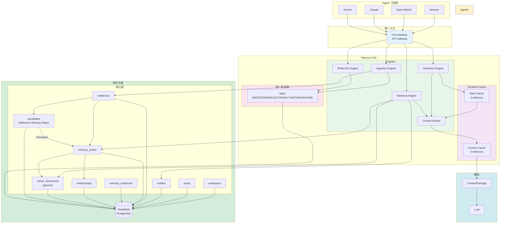

# Personal AI Memory Hub — Implementation Architecture 设计文档

> **版本**: 1.0  
> **日期**: 2026-06-23  
> **阶段**: 第八阶段  
> **状态**: 已确认  
> **作者**: 系统架构组

---

## 1. 设计目标

本文档定义 Memory Hub 的**实现架构**（Implementation Architecture），在已有架构设计（01~07）基础上，明确以下实现层面的决策：

* 数据库 Schema 的最终设计（Candidate Schema、State Schema、Context Package）
* API 契约与不可变性约束
* 执行模式与升级路径
* Queue 架构的统一简化
* Runtime Cache 设计
* Vector Storage 方案锁定
* Retrieval 流程约束
* MVP 范围界定
* 反射（Reflection）模式切换能力

---

## 2. 已锁定原则（约束）

以下原则在本次 Implementation Architecture 中**不可违背**：

| # | 原则 | 说明 |
|---|------|------|
| 1 | Memory Hub = Memory Infrastructure | 记忆基础设施，非业务逻辑 |
| 2 | Memory Hub = Witness, Not Actor | 见证者，非行动者 |
| 3 | Agent 永远位于 Memory Hub 之外 | 解耦，可替换 |
| 4 | Agent 不允许直接修改 Memory | 必须通过 Ingestion Pipeline |
| 5 | Evidence Based Memory | No Evidence = No Memory |
| 6 | No Orphan Memory | 每条记忆至少关联一个证据 |
| 7 | Summary 属于 Observation | 不能直接成为长期记忆 |
| 8 | Reflection 仅允许 Memory Maintenance | 不允许 Recommendation / Planning / Decision Making / Tool Invocation |
| 9 | Project 属于 Entity | 不单独建 Project 表 |

---

## 3. Memory 模型

### 3.1 层级模型

```
Entity
  └─ MemoryNode
       ├─ Observation
       ├─ Pattern
       ├─ Belief
       └─ State（运行时激活，不落库）
```

### 3.2 记忆演化路径

```
Observation
  ↓
Candidate
  ↓
Pattern
  ↓
Belief
  ↓
State
```

### 3.3 State 的定义

```
State = Belief + Current Context
```

**关键约束**：

* State **不持久化**到数据库
* State 允许短时缓存（State Cache）
* State 保存的是**引用**，不是完整内容
* State 引用来源：`sourceBeliefIds[]`、`sourcePatternIds[]`

---

## 4. Candidate Schema

### 4.1 设计决策

**采用独立表**。

Candidate 独立于 MemoryNode，是 Reflection 的工作对象。

### 4.2 Candidate → Memory 的晋升流程

```
Candidate（独立表）
  ↓ Reflection Engine 验证
  ↓ 证据链完整 + 满足晋升条件
Promotion（晋升）
  ↓
MemoryNode（正式 Memory，写入 memory_nodes 表）
```

### 4.3 Candidate 表关键字段

| 字段 | 类型 | 说明 |
|------|------|------|
| `id` | UUIDv7 | 主键 |
| `workspace_id` | UUIDv7 | 所属 Workspace |
| `entity_id` | UUIDv7 | 所属 Entity |
| `area_id` | UUIDv7 | 所属 Area |
| `content` | TEXT | 候选内容 |
| `candidate_type` | VARCHAR | 候选类型（pattern / belief） |
| `evidence_source` | VARCHAR | 证据来源（conversation / document / observation） |
| `evidence_id` | UUID | 证据来源 ID |
| `evidence_chain` | JSONB | 完整证据链 |
| `evidence_count` | INTEGER | 关联证据数量（≥ 1） |
| `evidence_strength` | FLOAT | 证据强度评分 |
| `status` | VARCHAR | `candidate` / `confirmed` / `archived` / `orphaned` |
| `verified_at` | TIMESTAMP | 验证通过时间 |
| `verified_by` | VARCHAR | `rule_engine` / `reflection_engine` |
| `ingested_by` | VARCHAR | 唯一合法值：`ingestion_pipeline` |
| `ingestion_timestamp` | TIMESTAMP | 通过 Ingestion Pipeline 的时间 |
| `modified_by` | VARCHAR | 仅限 `reflection_engine` / `maintenance_queue` |
| `modification_reason` | TEXT | 修改原因 |
| `created_at` | TIMESTAMP | 创建时间 |
| `updated_at` | TIMESTAMP | 更新时间 |

### 4.4 约束

* 任何 Candidate 必须携带证据（P6 / P7）
* Candidate 不能直接成为 Long-Term Memory，必须经过 Promotion
* Candidate 不允许来自 Agent 直接写入（P4）
* Candidate 不允许被 Agent 修改（P4）
* 每个 Candidate 必须有至少一个可验证的证据

---

## 5. State Schema

### 5.1 设计决策

**State 不落库**。

允许短时缓存（State Cache），缓存内容为 `RuntimeState`。

### 5.2 State Cache 存储内容

| 字段 | 类型 | 说明 |
|------|------|------|
| `entity_id` | UUIDv7 | 所属 Entity |
| `runtime_state` | JSONB | 运行时 State 快照 |
| `source_belief_ids` | UUID[] | 来源 Belief ID 列表 |
| `source_pattern_ids` | UUID[] | 来源 Pattern ID 列表 |
| `activated_at` | TIMESTAMP | 激活时间 |
| `expires_at` | TIMESTAMP | 过期时间 |

### 5.3 约束

* State 保存的是**引用**，不是完整内容
* State 是 Runtime Layer 的概念，不是持久化层
* State Cache 是临时性的，不保证持久化

---

## 6. Context Package

### 6.1 定义

ContextPackage 是 LLM 的**唯一入口**。

### 6.2 Runtime Flow

```
ActivationContext
  ↓
RetrievalResult
  ↓
RuntimeState
  ↓
ContextPackage
```

### 6.3 ContextPackage 结构

| 层级 | 内容 | 预算占比 |
|------|------|----------|
| Layer 1 | Current Session | 40% |
| Layer 2 | Current Entity | 30% |
| Layer 3 | Graph Expansion | 20% |
| Layer 4 | Global Cognitive Memory | 10% |

### 6.4 约束

* ContextPackage 必须支持 Token Budget
* ContextPackage 必须支持 Source Trace
* ContextPackage 是 LLM 获取记忆的唯一通道

---

## 7. Execution Mode

### 7.1 V1：Direct Call

**必须通过 Port Interface**。

禁止业务逻辑直接依赖 Engine 实现。

### 7.2 预留升级路径

```
V1: Direct Call
  ↓ 预留升级接口
V2+: Event Driven
```

### 7.3 升级项

#### UPG-001: Direct Call → Event Driven Migration

| 项目 | 内容 |
|------|------|
| 编号 | UPG-001 |
| 阶段 | Deferred V2+ |
| 说明 | 从 Direct Call 升级到 Event Driven 架构 |
| 前提 | 当前 Direct Call 通过 Port Interface 隔离，升级时只需替换调用层 |

---

## 8. API Design

### 8.1 API Entry Layer（Phase B 术语变更）

> **Phase B 变更**：原"API Layer"更名为 **API Entry Layer**。
> Entry 层职责：协议适配、DTO 转换、认证、能力检查。Entry 层不包含业务逻辑。
> 支持 REST / MCP / CLI / SDK / Agent 等多种 Entry 适配器。
> 原则：One Capability, One Implementation；Multiple Entry Adapters。
> 详见 `10_7_Implementation_API_Entry.md`（Phase B-7）。

### 8.3 Memory Immutable 约束

**禁止**：

```
updateMemory()
deleteMemory()
```

**允许**：

```
correctMemory()    // 修正错误记忆
archiveMemory()    // 归档记忆
```

**新增关系**：

```
CORRECTS    // 修正关系
SUPERSEDES  // 替代关系
```

### 8.4 API 契约

| 方法 | 输入 | 输出 | 说明 |
|------|------|------|------|
| `ingestEvidence()` | Raw Conversation | Observation ID | 摄入证据 |
| `correctMemory()` | Memory ID + Correction | Updated Memory | 修正记忆 |
| `retrieveContext()` | Query + Entity | ContextPackage | 检索上下文 |
| `runReflection()` | Task ID | Reflection Result | 执行反射 |
| `runArchive()` | Memory Batch | Archive Result | 执行归档 |
| `getEntity()` | Entity ID | Entity | 获取实体 |
| `getMemoryNode()` | MemoryNode ID | MemoryNode | 获取记忆节点 |
| `getEvidenceChain()` | Memory ID | Evidence Chain | 获取证据链 |

### 8.5 约束

* Memory 一旦创建，不可直接更新或删除
* 修正通过 `correctMemory()` 完成，保留原始版本
* 归档通过 `archiveMemory()` 完成，不删除原始数据

---

## 9. Queue Design

### 9.1 统一任务表

**采用统一 `tasks` 表**。

**禁止**为 Ingestion / Reflection / Activation / Archive 分别建独立队列表。

### 9.2 Task Type

| 类型 | 说明 |
|------|------|
| `INGESTION` | 证据摄入任务 |
| `REFLECTION` | 反射任务 |
| `ACTIVATION` | 激活任务 |
| `ARCHIVE` | 归档任务 |

### 9.3 Reflection Trigger

**Evidence Driven + Debounce**。

* 同一 Entity / Area 存在待执行 Reflection Task 时不重复创建
* 采用 Debounce 机制，避免短时间内重复触发

### 9.4 tasks 表关键字段

| 字段 | 类型 | 说明 |
|------|------|------|
| `id` | UUIDv7 | 主键 |
| `workspace_id` | UUIDv7 | 所属 Workspace |
| `task_type` | VARCHAR | INGESTION / REFLECTION / ACTIVATION / ARCHIVE |
| `entity_id` | UUIDv7 | 关联 Entity |
| `area_id` | UUIDv7 | 关联 Area |
| `status` | VARCHAR | pending / running / completed / failed / dead_letter |
| `evidence_driven` | BOOLEAN | 是否证据驱动 |
| `debounce_key` | VARCHAR | Debounce 键（Entity/Area 组合） |
| `retry_count` | INTEGER | 重试次数 |
| `max_retries` | INTEGER | 最大重试次数 |
| `payload` | JSONB | 任务负载 |
| `created_at` | TIMESTAMP | 创建时间 |
| `updated_at` | TIMESTAMP | 更新时间 |
| `completed_at` | TIMESTAMP | 完成时间 |

### 9.5 约束

* 所有队列逻辑统一在 `tasks` 表中管理
* 保留 Retry / DLQ 能力
* V1 MVP 仅实现 INGESTION / REFLECTION / ACTIVATION 三种类型

---

## 10. Runtime Cache

### 10.1 缓存类型

| 缓存 | 说明 |
|------|------|
| State Cache | 运行时 State 缓存 |
| Context Cache | Context Package 缓存 |

### 10.2 V1 实现

**In-Memory Cache**。

**禁止 Redis**。

### 10.3 升级项

#### UPG-002: Redis Cache

| 项目 | 内容 |
|------|------|
| 编号 | UPG-002 |
| 阶段 | Deferred V2+ |
| 说明 | 从 In-Memory Cache 升级到 Redis 分布式缓存 |
| 前提 | 当前 Cache 接口已抽象，升级时只需替换底层存储 |

---

## 11. Vector Storage

### 11.1 设计决策

**原方案**：Chroma  
**修订为**：Vector Storage Layer

### 11.2 V1 实现

**Supabase pgvector**。

* Truth Source：Supabase
* Retrieval Index：pgvector

**禁止引入 Chroma 作为 MVP 必需组件**。

### 11.3 升级项

#### UPG-003: External Vector Store

| 项目 | 内容 |
|------|------|
| 编号 | UPG-003 |
| 阶段 | Deferred V2+ |
| 说明 | 从 Supabase pgvector 升级到外部向量存储 |
| 候选方案 | Chroma / Qdrant / Weaviate |
| 前提 | vector_documents 表结构已抽象，升级时只需更换检索引擎 |

### 11.4 升级项（合并）

#### UPG-004: Supabase pgvector → External Vector Store

| 项目 | 内容 |
|------|------|
| 编号 | UPG-004 |
| 阶段 | Deferred V2+ |
| 说明 | 同 UPG-003，统一为一个升级项 |

> **注**：UPG-003 与 UPG-004 合并为 UPG-004。

---

## 12. Retrieval

### 12.1 流程

```
Vector Search
  ↓
Document ID
  ↓
Supabase 真数据
  ↓
RetrievalResult
```

### 12.2 约束

**禁止**：Vector Store 直接向 LLM 提供内容。

所有检索结果必须经过 Supabase 真数据回查，确保 LLM 获取的是权威数据。

---

## 13. Implementation Boundary

### 13.1 MVP 必须实现的表

| 序号 | 表名 | 说明 |
|------|------|------|
| 1 | `workspace` | 顶层容器 |
| 2 | `areas` | 一级领域划分 |
| 3 | `entities` | 实体（含 Project） |
| 4 | `evidences` | 证据（Observation 等） |
| 5 | `memory_nodes` | 记忆节点 |
| 6 | `memory_evidences` | 记忆与证据关联 |
| 7 | `relationships` | 实体间关系 |
| 8 | `vector_documents` | 向量文档 |
| 9 | `tasks` | 统一任务表 |

### 13.2 MVP 必须实现的 Engine

| 序号 | Engine | 说明 |
|------|--------|------|
| 1 | Ingestion Engine | 证据摄入 |
| 2 | Retrieval Engine | 多维检索 |
| 3 | Activation Engine | State 激活 |
| 4 | Context Builder | 上下文构建 |
| 5 | Reflection Engine | 记忆反思 |
| 6 | State Cache | 运行时状态缓存 |
| 7 | Context Cache | 上下文缓存 |

### 13.3 Reflection 模式

**默认开启自动 Reflection 与自动 Promotion**。

但必须预留三种模式切换能力：

| 模式 | 说明 |
|------|------|
| Auto | 自动 Reflection + 自动 Promotion |
| Manual | 手动触发 Reflection + 手动确认 Promotion |
| Hybrid | 自动 Reflection + 手动确认 Promotion |

---

## 14. 升级路径汇总

| 编号 | 升级项 | 阶段 |
|------|--------|------|
| UPG-001 | Direct Call → Event Driven Migration | V2+ |
| UPG-002 | In-Memory Cache → Redis Cache | V2+ |
| UPG-004 | Supabase pgvector → External Vector Store (Chroma/Qdrant/Weaviate) | V2+ |

---

## 15. Memory Hub 实现架构图



---

## 16. 与已有文档的关系

| 文档 | 引用关系 |
|------|----------|
| 01 | 记忆类型体系、生命周期、分类体系（本文档约束其实现方式） |
| 02 | Memory Engine API、Context Builder 四层结构（本文档定义 ContextPackage） |
| 03 | Entity / MemoryNode / Relationship 模型（本文档定义 MVP 表结构） |
| 04 | Schema / Reflect / Archive（本文档定义 Candidate Schema 和统一 tasks 表） |
| 05 | Lifecycle / Reflection Engine（本文档定义 Reflection 模式切换） |
| 06 | Runtime Architecture（本文档定义 Runtime Cache 和 Execution Mode） |
| 07 | Boundary Review（本文档约束 API 不可变性和 Agent 交互边界） |

---

## 17. 最终架构原则

### 17.1 Memory Immutable

> 记忆一旦创建，不可直接更新或删除。修正和归档是唯一合法的变更路径。

### 17.2 Candidate Independent

> Candidate 独立于 MemoryNode，是 Reflection 的工作对象。Promotion 后生成正式 Memory。

### 17.3 State Is Reference

> State 保存引用而非完整内容。State = Belief + Current Context，属于 Runtime Layer。

### 17.4 Unified Task

> 禁止为不同队列分别建表。统一 `tasks` 表管理所有任务类型。

### 17.5 Supabase Truth

> Supabase 是唯一的 Truth Source。Vector Store 不直接向 LLM 提供内容。

### 17.6 Abstract Upgrade

> 所有升级项通过抽象层隔离，确保 V1 → V2+ 的平滑过渡。

### 17.7 API Entry Layer（Phase B 新增）

> 原"API Layer"更名为 API Entry Layer。职责为协议适配、DTO 转换、认证、能力检查。不包含业务逻辑。

### 17.8 Engine as Domain Capability（Phase B 新增）

> Engine 代表领域能力，不是 Agent、不是 Service、不是 Repository。Engine 必须无状态、可复用、能力导向。

### 17.9 No Direct Repository Access by Engine（Phase B 新增）

> Engine 不直接访问 Repository。数据持久化由 Service + Repository 完成。Service 是编排层。

### 17.10 Project Memory Philosophy（Phase B 新增）

> 文档 = 长期记忆，Chat = 工作记忆，代码 = 可执行记忆。以文档为权威来源，而非对话历史。

### 17.11 EntityRepository Persistence Only（Phase B-5 新增）

> EntityRepository 保持持久化层边界。不执行 merge 决策、alias 冲突决策、relationship 验证。Repository 仅返回 Domain Objects，Never Projection, Never DTO。

---

## 附录 A：MVP 表结构速查

| 表名 | 关键字段 |
|------|----------|
| `workspace` | id, name, created_at |
| `areas` | id, workspace_id, name, parent_area_id |
| `entities` | id, workspace_id, area_id, parent_entity_id, entity_type |
| `evidences` | id, workspace_id, entity_id, content, evidence_type |
| `memory_nodes` | id, entity_id, parent_node_id, level, content, generated_by |
| `memory_evidences` | id, memory_node_id, evidence_id, relationship_type |
| `relationships` | id, workspace_id, source_id, target_id, relationship_type |
| `vector_documents` | id, workspace_id, source_type, source_id, embedding |
| `tasks` | id, workspace_id, task_type, entity_id, status, payload |
| `candidates` | id, workspace_id, entity_id, content, status, evidence_chain |

---

## 附录 B：API 契约速查

| 方法 | 说明 | 约束 |
|------|------|------|
| `ingestEvidence()` | 摄入证据 | 必须通过 Ingestion Pipeline |
| `correctMemory()` | 修正记忆 | 保留原始版本 |
| `retrieveContext()` | 检索上下文 | 返回 ContextPackage |
| `runReflection()` | 执行反射 | 自动/手动/Hybrid 模式 |
| `runArchive()` | 执行归档 | 不删除原始数据 |
| `getEntity()` | 获取实体 | — |
| `getMemoryNode()` | 获取记忆节点 | — |
| `getEvidenceChain()` | 获取证据链 | 完整追溯 |

---

## 附录 C：升级路径速查

| 编号 | 升级项 | 阶段 | 影响范围 |
|------|--------|------|----------|
| UPG-001 | Direct Call → Event Driven | V2+ | 执行模式 |
| UPG-002 | In-Memory Cache → Redis | V2+ | Runtime Cache |
| UPG-004 | pgvector → External Vector Store | V2+ | Vector Storage |

---

## 附录 D：文档变更记录

| 版本 | 日期 | 变更说明 | 状态 |
|------|------|----------|------|
| 1.1 | 2026-06-26 | Phase B 修订：(1) API Layer 更名为 API Entry Layer (2) Engine 重新定义为 Domain Capability (3) 新增 MemoryEngine 不直接访问 Repository 约束 (4) 新增 Project Memory 哲学 (5) 新增依赖规则原则 (6) 附录 C 补充 Phase B 升级项 | ✅ 已确认 |

---

*本文档仅记录已达成共识的设计决策，未涉及的内容不在本文档范围内。*
