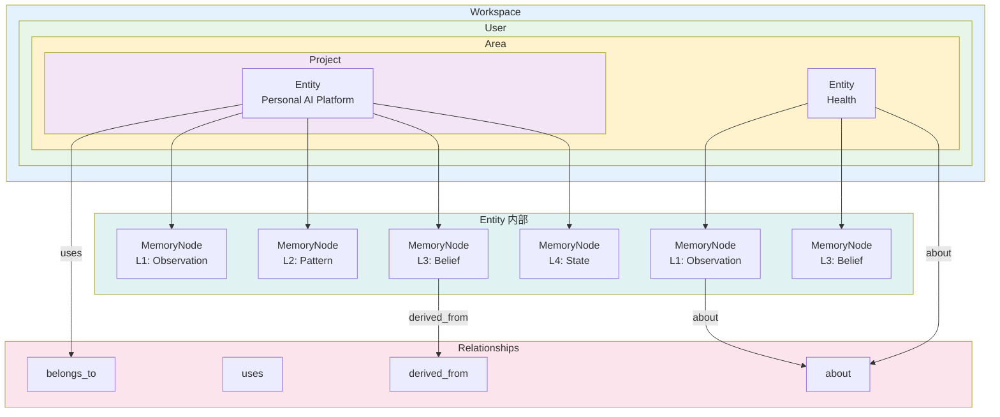
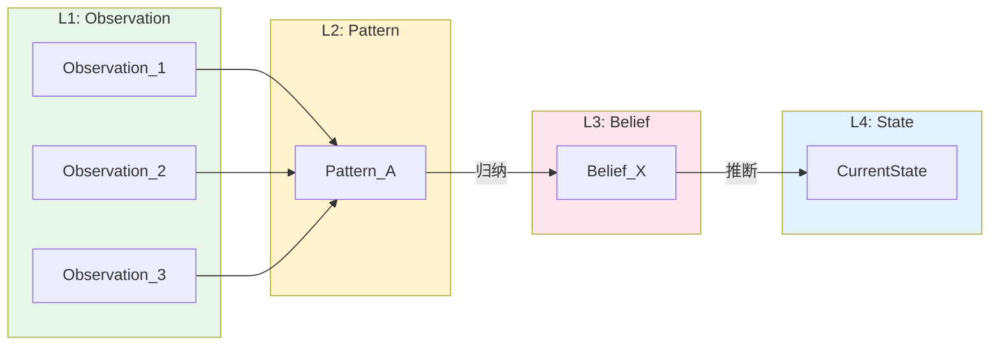
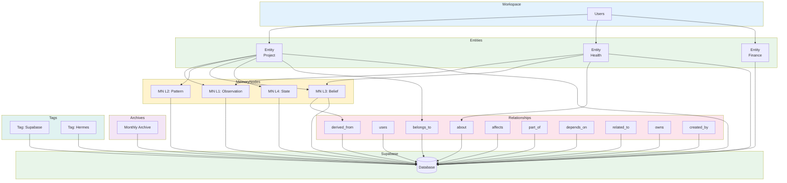

# Personal AI Memory Hub — Entity 与 Memory Graph 设计文档

> **版本**: 1.0  
> **日期**: 2026-06-18  
> **阶段**: 第三阶段  
> **状态**: 已确认  
> **作者**: 系统架构组

---

## 1. 设计目标

本阶段聚焦 Memory Hub 的数据建模层面，解决以下核心问题：

* Entity 的判定标准与数量控制
* MemoryNode 的层级模型设计
* 顶层组织结构升级（Workspace 引入）
* Memory Graph 的图结构设计
* Relationship 体系设计
* Reflect 推导链与 Explainable Memory 支持

---

## 2. Entity 定义

### ADR-001: Entity 准入标准

| 项目 | 内容 |
|------|------|
| **决策编号** | ADR-001 |
| **状态** | Final Decision |
| **日期** | 2026-06-18 |
| **上下文** | Memory Hub 中 Entity 数量直接影响系统复杂度与检索效率。无节制地创建 Entity 会导致图结构膨胀、推理成本上升、维护困难。 |
| **决策** | 只有满足以下条件之一的对象允许成为 Entity： |

1. **有生命周期** — 对象存在明确的出生、发展、消亡过程
2. **有状态变化** — 对象的状态会随时间发生可记录的变化
3. **未来需要被引用** — 其他记忆或推理会反复引用该对象
4. **未来需要被推理** — 该对象是推理链条中的必要节点

> **否则只作为 Observation 保存。**

**理由**：

* Entity 是 Memory Graph 中的高级节点，承载关系与推理。过度使用会导致图结构失控。
* Observation 是轻量级事实记录，大量存在不会造成负担。
* 控制 Entity 数量等于控制系统的复杂度上限。

**后果**：

* 大量零散事实将作为 Observation 附着在少数 Entity 上，而非各自独立为 Entity。
* 未来如需将 Observation 升级为 Entity，可通过推导链追溯其来源。

---

### ADR-002: Entity 与 Observation 的区分原则

| 项目 | 内容 |
|------|------|
| **决策编号** | ADR-002 |
| **状态** | Final Decision |
| **日期** | 2026-06-18 |
| **决策** | 不要问"Observation 重不重要"，而应该问"Observation 是否值得拥有独立生命周期"。 |

**理由**：

* "重要性"是一个模糊概念，容易导致 Entity 泛滥。
* "是否值得拥有独立生命周期"是一个可操作的判定标准。
* 大量 Observation 允许存在，不会增加系统复杂度。
* Entity 必须严格控制数量。

**核心认知**：

> Memory Hub 的价值来自：  
> Observation → Pattern → Belief → State  
> 而非来自大量 Entity。

---

## 3. Entity Type 体系

### ADR-003: Entity Type 设计策略

| 项目 | 内容 |
|------|------|
| **决策编号** | ADR-003 |
| **状态** | Final Decision |
| **日期** | 2026-06-18 |
| **上下文** | Entity Type 用于对 Entity 进行分类，影响检索、推理、上下文构建等场景。Type 体系需要在"足够表达语义"与"不过度固化"之间取得平衡。 |
| **决策** | 采用"核心类型 + 可扩展"策略。 |

**第一版核心类型**：

| Type | 语义 | 说明 |
|------|------|------|
| `User` | 用户 | 系统的使用者 |
| `Area` | 领域 | 一级领域划分（AI / Work / Family 等） |
| `Project` | 项目 | 二级项目划分（隶属于 Area） |
| `Object` | 通用对象 | 兜底类型，用于不属于前三类的实体 |

**理由**：

* `User` / `Area` / `Project` 属于强语义类型，贯穿整个系统架构。
* `Object` 作为通用兜底，避免 Type 体系过早膨胀。
* 长期价值来自 Relationship 而非 Entity Type。

**未来演化**（Future Evolution）：

* 可根据实际使用场景扩展新的核心类型。
* 已有 Entity 的 Type 可以随时更改。
* Type 体系不影响 Memory Graph 的图结构本身。

---

## 4. Memory 层级模型

### ADR-004: MemoryNode 层级模型

| 项目 | 内容 |
|------|------|
| **决策编号** | ADR-004 |
| **状态** | Final Decision |
| **日期** | 2026-06-18 |
| **上下文** | 原设计中 Entity 直接包含 Observations、Beliefs、Current State。新设计将其统一抽象为 MemoryNode 的不同 Level，提供更灵活的层级结构和扩展能力。 |
| **决策** | Entity 包含 MemoryNode 和 Relationship。MemoryNode 具有 Level 属性，不同 Level 对应不同类型的记忆内容。 |

**层级模型**：

```
Entity
├─ MemoryNode
│  ├─ L1: Observation（观察记录）
│  ├─ L2: Pattern（行为模式）
│  ├─ L3: Belief（AI 认知）
│  └─ L4: State（当前状态）
└─ Relationship
```

**关键说明**：

* Observation、Pattern、Belief、State **不是独立表**。
* 它们属于 MemoryNode 的不同 Level。
* 推荐 Level 映射：

| Level | 类型 | 说明 |
|-------|------|------|
| L1 | Observation | 事实记录，保留历史 |
| L2 | Pattern | 从 Observation 中归纳出的模式 |
| L3 | Belief | AI 基于 Pattern 形成的认知推断 |
| L4 | State | 实体的当前状态结论（运行时激活，非持久化实体，参见 05 第 12 章） |

* 未来允许扩展更高 Level（L5、L6…）。

**理由**：

* 统一为 MemoryNode 减少了数据库表的复杂度。
* Level 属性提供了天然的层级语义。
* 支持 Reflect 推导链（Observation → Pattern → Belief → State）。
* 为 Explainable Memory 奠定基础。

**未来演化**（Future Evolution）：

* Level 的定义和数量可以扩展。
* Level 之间的推导规则可以在未来细化。

---

### ADR-005: Memory Hub 价值来源

| 项目 | 内容 |
|------|------|
| **决策编号** | ADR-005 |
| **状态** | Final Decision |
| **日期** | 2026-06-18 |
| **决策** | Memory Hub 的价值来自推导链，而非 Entity 数量。 |

```
Observation
  ↓ (归纳)
Pattern
  ↓ (推断)
Belief
  ↓ (综合)
State
```

**理由**：

* 大量 Entity 只是增加了图的规模，不增加知识的深度。
* 真正的价值在于从 Observation 到 State 的推导过程。
* 这一原则指导 Entity 创建的数量控制（ADR-001 / ADR-002）。

---

## 5. 顶层结构升级

### ADR-006: Workspace 引入

| 项目 | 内容 |
|------|------|
| **决策编号** | ADR-006 |
| **状态** | Final Decision |
| **日期** | 2026-06-18 |
| **上下文** | 原结构为 User → Area → Project → Memory。随着需求演进，系统可能需要支持家庭共享、多用户协作、团队场景。需要在现有结构之上增加一个抽象层。 |
| **决策** | 引入 Workspace 作为顶层容器。 |

**升级后的结构**：

```
Workspace
  ↓
  User
    ↓
    Area
      ↓
      Project
        ↓
        Entity
```

**理由**：

* Workspace 是顶层容器，可以包含多个 User。
* 单用户场景：Workspace = 个人空间。
* 家庭共享场景：Workspace = 家庭空间，包含多个家庭成员。
* 多用户/团队场景：Workspace = 团队空间，支持角色与权限。
* 现有 Area / Project / Memory 结构保持不变，向下兼容。

**未来演化**（Future Evolution）：

* Workspace 的权限模型将在后续阶段设计。
* Workspace 之间的数据隔离策略待定。
* 跨 Workspace 的数据共享机制待定。

---

## 6. Memory Graph

### ADR-007: Memory Graph 本质

| 项目 | 内容 |
|------|------|
| **决策编号** | ADR-007 |
| **状态** | Final Decision |
| **日期** | 2026-06-18 |
| **上下文** | 需要明确 Memory Hub 与传统知识库的本质区别，指导后续数据库设计与 API 设计。 |
| **决策** | Memory Hub 本质上是 Graph 结构，而非传统关系型知识库。 |

**核心组成**：

```
Memory Graph = Entity + MemoryNode + Relationship
```

**与传统知识库的区别**：

| 维度 | 传统知识库 | Memory Graph |
|------|-----------|-------------|
| 基本单元 | 文档 / 条目 | Entity + MemoryNode |
| 关联方式 | 标签 / 分类 | Relationship（图边） |
| 推理能力 | 有限 | 原生支持图遍历与推导 |
| 解释性 | 弱 | 通过 derived_from 支持 Explainable Memory |

**理由**：

* Graph 思维天然支持 Entity 之间的关系表达。
* Relationship 是第一公民，与 Entity、MemoryNode 同等重要。
* 为未来的图查询、图推理、图可视化奠定基础。

---

## 7. Relationship 体系

### ADR-008: Relationship 设计策略

| 项目 | 内容 |
|------|------|
| **决策编号** | ADR-008 |
| **状态** | Final Decision |
| **日期** | 2026-06-18 |
| **上下文** | Relationship 是 Memory Graph 的连接边，决定了图结构的表达能力。需要在"覆盖核心场景"与"保持简洁"之间取得平衡。 |
| **决策** | 采用"核心关系 + 可扩展"策略。 |

**第一版核心关系**：

| 关系 | 方向 | 说明 | 示例 |
|------|------|------|------|
| `belongs_to` | 子→父 | 隶属关系 | Project belongs_to Area |
| `part_of` | 部分→整体 | 组成部分 | Observation part_of Entity |
| `uses` | 使用者→工具 | 使用关系 | Project uses Supabase |
| `depends_on` | 依赖方→被依赖方 | 依赖关系 | Project depends_on API |
| `related_to` | 双向 | 一般关联 | Entity related_to Entity |
| `affects` | 影响方→受影响方 | 影响关系 | Decision affects Project |
| `derived_from` | 推导方→源数据 | 推导来源 | Belief derived_from Observation |
| `owns` | 所有者→被拥有 | 拥有关系 | User owns Entity |
| `created_by` | 产物→创造者 | 创建关系 | Project created_by User |
| `about` | 内容→主题 | 主题关联 | Observation about User |

**理由**：

* 这 10 种关系覆盖了 Entity 之间最常见的关联模式。
* 每种关系都有明确的语义方向，避免歧义。
* 未来可根据实际需要添加新的关系类型。

**未来演化**（Future Evolution）：

* 关系的语义、方向、数量均可扩展。
* 关系的权重（strength）可在未来引入。
* 关系的时间有效性（valid_from / valid_to）可在未来引入。

---

### ADR-009: about 特殊关系

| 项目 | 内容 |
|------|------|
| **决策编号** | ADR-009 |
| **状态** | Final Decision |
| **日期** | 2026-06-18 |
| **上下文** | 零散的 Observation 需要一个机制挂接到对应的 Entity 上，否则它们将成为孤岛。 |
| **决策** | 引入 `about` 关系，用于将 Observation 挂接到主题 Entity。 |

**示例**：

```
Observation: "今天感冒了"
  → about →
Entity: User Health
```

**理由**：

* 解决了零散 Observation 的归属问题。
* 不需要为每个 Observation 创建独立 Entity。
* 通过 Relationship 建立语义连接，保持 Entity 数量的可控性。

---

## 8. Reflect 推导链

### ADR-010: Reflect 推导链设计

| 项目 | 内容 |
|------|------|
| **决策编号** | ADR-010 |
| **状态** | Final Decision |
| **日期** | 2026-06-18 |
| **上下文** | Memory Engine 的 reflect() API 需要从原始 Observation 推导出高层认知。推导过程需要可追溯、可解释。 |
| **决策** | 采用固定的四层推导链，并通过 `derived_from` 关系记录推导来源。 |

**推导链**：

```
Observation (L1)
  ↓ (归纳)
Pattern (L2)
  ↓ (推断)
Belief (L3)
  ↓ (综合)
State (L4)
```

**每条推导记录 `derived_from` 关系**：

```
Belief (L3)
  → derived_from →
[Observation_1, Observation_2, Observation_3]
```

**理由**：

* 固定推导链提供了清晰的知识进化路径。
* `derived_from` 关系支持 Explainable Memory。
* AI 能够解释某个 Belief 是如何从多个 Observation 推导出来的。

**未来演化**（Future Evolution）：

* 推导规则（归纳 / 推断 / 综合）的具体算法待定。
* 推导链的可视化展示待定。
* 推导置信度的传递与计算待定。

---

## 9. 数据库方向

### ADR-011: 核心表规划

| 项目 | 内容 |
|------|------|
| **决策编号** | ADR-011 |
| **状态** | Final Decision |
| **日期** | 2026-06-18 |
| **上下文** | Memory Hub 的持久化后端确定为 Supabase（PostgreSQL）。需要规划核心表结构。 |
| **决策** | 核心表预计为以下五张。具体字段设计尚未开始。 |

**核心表**：

| 表名 | 说明 |
|------|------|
| 3 | `entities` | Entity 表，存储所有实体（含 Project/Agent/Tool 等） |
| 4 | `memory_nodes` | MemoryNode 表，存储所有记忆节点（含 Level 属性） |
| 5 | `relationships` | Relationship 表，存储实体间关系 |
| 6 | `vector_documents` | 独立向量层，存储高价值内容的 embedding |
| 7 | `archives` | Archive 表，存储 Monthly/Yearly 归档数据 |
| 8 | `tags` | Tag 表，存储标签及标签关联 |
| 9 | `tag_links` | Tag 关联表，多对多关联 |
| 10 | `tasks` | 统一任务表（替代原 reflect_tasks） |
| 11 | `user_profiles` | 用户档案表 |

**下一步**：

* 下一阶段将专门设计 Supabase Schema（参见 `04_Schema_Archive_Reflect.md`）。
* Schema 设计将基于本阶段的 Entity / MemoryNode / Relationship 模型。
* 完整表结构、外键关系、向量化策略详见 04。

**未来演化**（Future Evolution）：

* 表结构可根据实际需求增删改。
* 索引策略、分区策略待定。
* 向量检索（pgvector）集成待定。

---

## 10. 架构图

### 10.1 Memory Graph 结构图



### 10.2 Reflect 推导链图



### 10.3 Memory Graph 总体架构图



---

## 11. 数据流总结

```
Workspace
  └─ User
       └─ Area
            └─ Project
                 └─ Entity
                      ├─ MemoryNode (L1: Observation)
                      ├─ MemoryNode (L2: Pattern)
                      ├─ MemoryNode (L3: Belief)
                      └─ MemoryNode (L4: State)

Relationship 连接 Entity 与 MemoryNode 之间：
  belongs_to / part_of / uses / depends_on / related_to /
  affects / derived_from / owns / created_by / about

Reflect 推导链：
  Observation(L1) → Pattern(L2) → Belief(L3) → State(L4)
  每条推导通过 derived_from 关系记录来源

持久化：
entities / memory_nodes / relationships / archives / tags / vector_documents / tasks / user_profiles → Supabase
```

---

## 12. 与前两阶段设计的关系

| 维度 | 第一阶段（骨架） | 第二阶段（Engine + Context） | 第三阶段（Entity + Graph） |
|------|------------------|------------------------------|---------------------------|
| 关注点 | 记忆类型、生命周期、分类体系 | API 设计、上下文构建、实体模型 | 数据建模、图结构、推导链 | 身份管理、合并策略、领域不变量 |
| 记忆类型 | Objective / Knowledge / Cognitive | Entity = Observations + Beliefs + Current State | MemoryNode (L1-L4) + Relationship | Created → Active → Merged |
| 组织模型 | User → Area → Project → Memory | 同上 + Tag | Workspace → User → Area → Project → Entity |
| 图结构 | 未涉及 | 未涉及 | Entity + MemoryNode + Relationship |
| 推导链 | 月度推导（粗粒度） | 认知更新（API 层） | Reflect 推导链（细粒度，L1→L4） |
| 数据库 | Supabase（方向） | 未涉及 | 核心表规划（entities/memory_nodes/relationships/archives/tags） |

---

## 附录 A：ADR 索引

| 编号 | 主题 | 状态 |
|------|------|------|
| ADR-001 | Entity 准入标准 | Final Decision |
| ADR-002 | Entity 与 Observation 的区分原则 | Final Decision |
| ADR-003 | Entity Type 设计策略 | Final Decision |
| ADR-004 | MemoryNode 层级模型 | Final Decision |
| ADR-005 | Memory Hub 价值来源 | Final Decision |
| ADR-006 | Workspace 引入 | Final Decision |
| ADR-007 | Memory Graph 本质 | Final Decision |
| ADR-008 | Relationship 设计策略 | Final Decision |
| ADR-009 | about 特殊关系 | Final Decision |
| ADR-010 | Reflect 推导链设计 | Final Decision（具体 Workflow 参见 05 第 11 章） |
| ADR-011 | 核心表规划 | Final Decision |
| ADR-012 | Engine 重新定义（Phase B） | Final Decision（Engine = Domain Capability，参见 10_1 第 6 章） |

---

## 附录 B：术语表

| 术语 | 说明 |
|------|------|
| Workspace | 顶层容器，支持单用户 / 家庭共享 / 多用户 / 团队场景 |
| Entity | 满足生命周期 / 状态变化 / 需引用 / 需推理条件的对象 |
| MemoryNode | Entity 内部的记忆节点，通过 Level 区分类型 |
| Observation (L1) | 事实记录，保留历史 |
| Pattern (L2) | 从 Observation 中归纳出的模式 |
| Belief (L3) | AI 基于 Pattern 形成的认知推断 |
| State (L4) | 实体的当前状态结论（运行时激活，非持久化实体，参见 05 第 12 章） |
| Relationship | Entity 与 MemoryNode 之间的图边 |
| Reflect 推导链 | Observation → Pattern → Belief → State 的推导路径 |
| Explainable Memory | 通过 derived_from 关系支持 AI 解释推导过程 |
| about | 特殊关系，将 Observation 挂接到主题 Entity |
| Ingestion Engine | 接收 Conversation，输出 Observation（参见 06 第 3.2 章） |
| Reflection Engine | 执行 Reflection Workflow，输出 Pattern/Belief（参见 06 第 3.3 章） |
| Activation Engine | 执行 State Activation，输出运行时 State（参见 06 第 3.4 章） |
| Retrieval Engine | 执行 Vector/Graph/Hybrid 检索（参见 06 第 3.5 章） |
| Context Builder | 四层 Context 构建（参见 06 第 3.6 章） |
| Scheduler | 事件驱动 + Cron 驱动的任务调度器（参见 06 第 3.7 章） |

---

## 附录 C：文档变更记录

| 版本 | 日期 | 变更说明 | 状态 |
|------|------|----------|------|
| 1.5 | 2026-06-26 | Phase B 修订：附录 A 补充 ADR-012（Engine 重新定义） | ✅ 已确认 |

---

*本文档仅记录已达成共识的设计决策，未涉及的内容不在本文档范围内。*
