# Personal AI Memory Hub — Memory Lifecycle 与 Reflection Engine 设计文档

> **版本**: 1.0  
> **日期**: 2026-06-18  
> **阶段**: 第五阶段  
> **状态**: 已确认  
> **作者**: 系统架构组

---

## 1. Memory Lifecycle

### 1.1 定义

Memory Lifecycle 定义了 MemoryNode 从诞生到演化的完整路径。

**四个层级**：

| 层级 | 类型 | 说明 |
|------|------|------|
| L1 | Observation | 事实记录，保留历史，永不删除 |
| L2 | Pattern | 从 Observation 中归纳出的模式 |
| L3 | Belief | AI 基于 Pattern 形成的认知推断 |
| L4 | State | 实体的当前状态结论 |

**演化路径**：

```
Observation (L1)
  ↓ 证据积累
Pattern (L2)
  ↓ 证据积累
Belief (L3)
  ↓ 上下文激活
State (L4)
```

### 1.2 Evidence Based Memory Principle

**核心原则**：

> Memory 不是时间累积系统。  
> Memory 是证据累积系统。

**所有认知升级基于 Evidence，不基于时间。**

这意味着：

* Pattern 的产生不取决于"出现了多少次"，而取决于"有多少独立证据支持"。
* Belief 的形成不取决于"观察了多少个月"，而取决于"证据链的强度和一致性"。
* State 的激活不取决于"过了多久"，而取决于"当前上下文与 Belief 的匹配度"。

### 1.3 明确废弃：Time Based Memory

以下基于时间门槛的设计**已被废弃**，不得在 Memory Lifecycle 中使用：

| 废弃设计 | 原因 |
|----------|------|
| 连续 30 天出现 | 时间不是证据，重复出现才是 |
| 连续出现 N 个月 | 月份计数与认知价值无关 |
| 最近 N 天出现 | 时效性不等于证据强度 |
| 超过 X 天后降级 | 记忆不应因时间流逝而失去价值 |
| 超过 Y 个月后归档 | Archive 是认知压缩，不是时间驱动的搬迁 |

**废弃理由**：

* 时间是一个中性变量，不携带任何语义信息。
* 基于时间的规则会导致：有价值的记忆因时间到了而被忽略，无价值的记忆因时间没到而被保留。
* Evidence Based 规则确保每条认知升级都有充分的证据支撑。

---

## 2. Memory Evolution Model

### 2.1 完整演化路径

```
Observation
  ↓
Evidence Accumulation
  ↓
Pattern
  ↓
Evidence Accumulation
  ↓
Belief
  ↓
Activation
  ↓
State
```

### 2.2 各层职责

#### Observation (L1)

**职责**：记录原始事实。

* 保留原始内容，不做任何推断。
* 记录来源（conversation / manual / explicit_command）。
* 记录时间戳、Area、Entity 归属。
* 不参与推理，只作为证据的原子单位。

**关键约束**：

* Observation 永不删除。
* Observation 不随时间衰减。
* Observation 的价值由其证据贡献决定，而非存在时长。

#### Pattern (L2)

**职责**：从 Observation 中归纳出的行为模式或趋势。

* 必须有至少 2 条独立 Observation 作为支撑。
* 每条支撑 Observation 必须可追溯。
* Pattern 不是简单重复，而是发现规律。

**示例**：

* "用户在每周五下午讨论 AI 相关话题"
* "用户在项目启动前倾向于先做 POC 验证"

#### Belief (L3)

**职责**：AI 基于 Pattern 形成的认知推断。

* 必须有至少 1 条 Pattern 作为支撑。
* 包含置信度（confidence）。
* 支持动态纠偏：新证据可更新置信度。
* 包含支持证据和矛盾证据的双向记录。

**示例**：

* "用户倾向于在投入开发前先进行 POC 验证"（置信度 0.85）
* "用户对维护成本的敏感度高于对新功能的追求"（置信度 0.72）

#### State (L4)

**职责**：实体的当前状态结论。

* 不是升级结果，而是 Belief 在当前上下文中的激活结果（参见 12）。
* 代表实体在当前时刻的最新认知状态。
* 随上下文变化而动态调整。

---

## 3. Evidence Model

### 3.1 核心字段

每条 Pattern 和 Belief 必须拥有以下证据字段：

| 字段 | 类型 | 说明 |
|------|------|------|
| `support_count` | INTEGER | 支撑证据数量 |
| `support_entities` | UUID[] | 支撑证据所属的 Entity ID 数组 |
| `support_areas` | UUID[] | 支撑证据所属的 Area ID 数组 |
| `confidence` | FLOAT | 置信度（0.0 ~ 1.0） |

### 3.2 证据规则

| 规则 | 说明 |
|------|------|
| Pattern 必须有证据 | 无证据的 Pattern 不允许创建 |
| Belief 必须有证据 | 无证据的 Belief 不允许创建 |
| Evidence 必须是 Observation | Pattern/Belief 的证据只能来自 Observation，不能来自其他 Pattern/Belief |
| 矛盾证据必须记录 | 与 Pattern/Belief 矛盾的 Observation 必须记录在案 |

### 3.3 证据链完整性

```
Belief
  └─ derived_from
       └─ Pattern_A (support_count=3)
            └─ derived_from
                 ├─ Observation_1 (about=User, area=Work)
                 ├─ Observation_2 (about=User, area=Work)
                 └─ Observation_3 (about=User, area=AI)
```

**设计意图**：

* 任何 Belief 都可以追溯到原始 Observation。
* 任何 Pattern 都可以追溯到支撑它的 Observation。
* 这保证了 Explainable Memory 的完整链路。

---

## 4. Memory Ingestion Pipeline

### 4.1 完整 Pipeline

```
Conversation
  ↓
Chunking
  ↓
Extraction
  ↓
Entity Linking
  ↓
Validation
  ↓
Observation
  ↓
Memory Store
  ↓
Reflect Queue
```

### 4.2 各阶段职责

#### Stage 1: Conversation

**输入**：用户通过手机/群聊/Web 发送的消息。

**职责**：

* 接收原始消息。
* 保留原始格式（文本、语音转写、图片 OCR 结果等）。
* 标记来源（phone / group_chat / web / explicit_command）。

#### Stage 2: Chunking

**输入**：Conversation 原始消息。

**职责**：

* 将长消息拆分为语义完整的片段。
* 每个 Chunk 不超过 500 字（或模型上下文窗口的合理比例）。
* 保留 Chunk 之间的顺序关系。

**废弃设计**：

* 不按时间窗口切分（如"每天一个 chunk"）。
* 不按固定行数切分。
* 按语义完整性切分。

#### Stage 3: Extraction

**输入**：Chunk。

**职责**：

* 从 Chunk 中提取潜在的事实陈述。
* 识别关键词、实体名、动作、决策。
* 输出候选 Observation。

**提取规则**：

* 排除 Noise 消息（问候语、无意义闲聊）。
* 保留所有包含事实信息的消息。
* 标记消息类型（question / insight / decision / progress / behavior_evidence）。

#### Stage 4: Entity Linking

**输入**：候选 Observation。

**职责**：

* 将 Observation 关联到正确的 Entity。
* 如果 Observation 中没有明确 Entity，则关联到 User 或 Object。
* 建立 `about` 关系（参见 03 ADR-009）。

**链接策略**：

* 显式提及 → 直接关联到对应 Entity。
* 隐式提及 → 通过 Area 推断所属 Entity。
* 无法关联 → 关联到 User Entity。

#### Stage 5: Validation

**输入**：已链接 Entity 的候选 Observation。

**职责**：

* 检查 Observation 是否符合写入标准。
* 去重：与已有 Observation 高度相似的标记为重复。
* 评分：调用 Scoring Engine（参见 7）计算 confidence/importance/signal_strength。

**验证规则**：

* 所有 Observation 必须通过 validation 才能进入 Memory Store。
* 验证失败的 Observation 进入 Reject 队列，可人工审查。

#### Stage 6: Observation

**输入**：通过 Validation 的 Observation。

**职责**：

* 将 Observation 写入 `memory_nodes` 表（level = L1）。
* 设置 `generated_by = 'user'` 或 `'manual'`。
* 建立与 Entity 的 `part_of` 关系。

#### Stage 7: Memory Store

**输入**：新写入的 Observation。

**职责**：

* 更新 `vector_documents`（如果 importance_score > importance_threshold）。
* 更新 `tag_links`（如果 Extraction 阶段生成了 Tag）。
* 更新 Entity 的统计信息（observation_count 等）。

#### Stage 8: Reflect Queue

**输入**：新写入的 Observation。

**职责**：

* 将 Observation 加入 Reflect Queue。
* 触发 Light Reflect（参见 10）。
* 当 Queue 积累到一定数量时，触发 Heavy Reflect。

**注意**：

* Reflect Queue 由统一 `tasks` 表管理（参见 08）。
* 采用 Evidence Driven + Debounce 机制触发 Reflection。
* 同一 Entity / Area 存在待执行 Reflection Task 时不重复创建。
* Debounce 机制避免短时间内重复触发。

---

## 5. Observation Schema

### 5.1 完整字段设计

以下字段定义 `memory_nodes` 表中 `level = L1` 的记录结构：

| 字段 | 类型 | 必填 | 说明 |
|------|------|------|------|
| `id` | UUIDv7 | ✅ | 主键 |
| `workspace_id` | UUIDv7 | ✅ | 所属 Workspace |
| `user_id` | UUIDv7 | ✅ | 所属用户 |
| `entity_id` | UUIDv7 | ✅ | 所属 Entity |
| `area_id` | UUIDv7 | ✅ | 所属 Area |
| `content` | TEXT | ✅ | Observation 原始内容 |
| `observation_type` | VARCHAR | ✅ | 类型（参见 6） |
| `source` | VARCHAR | ✅ | 来源（conversation / manual / explicit_command / archive_derived） |
| `confidence` | FLOAT | ✅ | 事实可信度（0.0~1.0），由用户显式确认可提高 |
| `importance` | FLOAT | ✅ | 重要性评分（0.0~1.0），由 Scoring Engine 计算 |
| `signal_strength` | FLOAT | ✅ | 信号强度（0.0~1.0），用于认知升级评估 |
| `status` | VARCHAR | ✅ | 状态（active / deprecated / superseded） |
| `created_at` | TIMESTAMP | ✅ | 创建时间 |
| `updated_at` | TIMESTAMP | ❌ | 更新时间 |
| `metadata` | JSONB | ❌ | 扩展元数据（conversation_id, chunk_index, language 等） |
| `evidence_links` | JSONB | ❌ | 证据关联（支持的 Pattern/Belief ID 数组） |

### 5.2 字段详细说明

| 字段 | 用途 |
|------|------|
| `id` | UUIDv7，时间有序，支持分布式生成 |
| `workspace_id` | 多 Workspace 隔离 |
| `user_id` | 用户维度统计和隔离 |
| `entity_id` | Observation 所属的 Entity |
| `area_id` | 所属 Area，用于 Context Builder Layer 2 |
| `content` | 原始内容，永不修改 |
| `observation_type` | 分类类型（参见 6） |
| `source` | 追溯数据来源 |
| `confidence` | 事实可信度，用户确认后提升 |
| `importance` | 用于向量化 Gate、Archive 权重、检索排序 |
| `signal_strength` | 用于 Pattern/Belief 发现的优先级排序 |
| `status` | 标记是否仍有效 |
| `metadata` | 灵活扩展，不改变 Schema |
| `evidence_links` | 反向追踪：这条 Observation 支持了哪些 Pattern/Belief |

---

## 6. Observation Type System

### 6.1 类型定义

| 类型 | observation_type 值 | 说明 | 示例 |
|------|---------------------|------|------|
| activity | `activity` | 用户参与的活动 | "今天参加了技术分享会" |
| decision | `decision` | 用户的明确决策 | "决定采用 Supabase 作为后端" |
| preference | `preference` | 用户的偏好表达 | "我喜欢简洁的代码风格" |
| fact | `fact` | 客观事实 | "用户居住在日本东京" |
| goal | `goal` | 用户设定的目标 | "计划三个月内完成日语 N2" |
| problem | `problem` | 遇到的问题或困难 | "遇到 Supabase 并发连接数限制" |
| event | `event` | 一次性事件 | "2026-06-15 完成了 MCP 记忆链路集成" |

### 6.2 用途

* Observation Type 用于初步分类，不用于认知升级。
* 认知升级（Pattern/Belief）基于 Evidence 而非 Type。
* Type 主要用于检索过滤和统计分析。

---

## 7. Scoring Engine

### 7.1 三套评分体系

**决策**：Scoring Engine 维护三套独立的评分，禁止混用。

| 评分 | 字段 | 用途 | 计算者 |
|------|------|------|--------|
| Confidence | `confidence` | 事实可信度 | 用户确认或系统推断 |
| Importance | `importance` | 内容重要性 | Scoring Engine（算法） |
| Signal Strength | `signal_strength` | 认知升级价值 | Scoring Engine（算法） |

### 7.2 职责区别

| 评分 | 职责 | 不用于 |
|------|------|--------|
| Confidence | 评估该 Observation 作为证据的可靠性 | 检索排序 |
| Importance | 评估该内容在系统中的全局重要性 | Pattern/Belief 发现 |
| Signal Strength | 评估该内容对认知升级的贡献潜力 | 向量化 Gate |

### 7.3 评分范围

所有评分均为 0.0 ~ 1.0 的浮点数。

---

## 8. Importance Algorithm

### 8.1 核心原则

> Importance ≠ Reflect Priority

**Importance 主要用于**：

| 用途 | 说明 |
|------|------|
| 向量化 Gate | importance > threshold 的 Observation 进入 vector_documents |
| Archive 权重 | Archive 摘要中 Importance 高的内容权重更大 |
| 检索排序 | Final Score = Similarity + Importance（参见 04 第 9 章） |
| Context 构建 | Context Builder 按 Importance 排序召回结果 |
| Reflect 参考 | Reflect 引擎参考 Importance 但不依赖 |

### 8.2 Importance 组成

```
Importance = Type_Weight × Entity_Weight + Recurrence + User_Action
```

| 组件 | 说明 | 权重范围 |
|------|------|----------|
| Type Weight | 不同类型的基础权重 | decision=0.9, fact=0.7, preference=0.8, goal=0.8, problem=0.6, event=0.5, activity=0.4 |
| Entity Weight | 所属 Entity 的重要性 | User=1.0, Project=0.8, Object=0.5 |
| Recurrence | 同一模式出现的频率 | 0.0~0.3（上限，不无限累加） |
| User Action | 用户显式标记的重要性 | 用户手动标记 +0.2 |

### 8.3 Importance 更新规则

* Importance 在 Validation 阶段计算一次。
* 不随时间衰减。
* 仅在以下情况更新：
  * 用户手动调整
  * 新证据出现且改变了 Entity Weight 或 Recurrence

---

## 9. Signal Strength

### 9.1 定义

> Signal Strength 专门用于认知升级价值评估。

**Signal Strength 用于**：

| 用途 | 说明 |
|------|------|
| Pattern Discovery | 高 Signal Strength 的 Observation 优先进入 Pattern 候选 |
| Belief Discovery | 高 Signal Strength 的 Pattern 优先进入 Belief 候选 |
| Reflect Priority | Reflect 引擎按 Signal Strength 排序待处理队列 |

### 9.2 Signal Strength 组成

```
Signal_Strength = Content_Richness × Novelty × Cross_Entity_Breadth
```

| 组件 | 说明 |
|------|------|
| Content Richness | 信息密度（字数/有效信息比） |
| Novelty | 是否为首次出现（首次=1.0，重复递减） |
| Cross-Entity Breadth | 是否跨多个 Entity/Area（单一=0.5，跨3+ = 1.0） |

### 9.3 Signal Strength vs Importance

| 维度 | Importance | Signal Strength |
|------|-----------|-----------------|
| 用途 | 检索、排序、向量化 | Pattern/Belief 发现 |
| 计算时机 | Validation 阶段 | Validation + Reflect 阶段 |
| 是否衰减 | 否 | 否 |
| 是否交叉 Entity | 不跨 Entity | 跨 Entity 加分 |

---

## 10. Reflection Engine

### 10.1 两级 Reflect

**决策**：Reflect 分为两级，职责严格划分。

| 级别 | 职责 | 触发条件 | 输出 |
|------|------|----------|------|
| Light Reflect | Observation → Pattern | Evidence Driven + Debounce | 候选 Pattern |
| Heavy Reflect | Pattern → Belief | Evidence Driven | 更新的 Belief |

### 10.2 Light Reflect

**职责**：

* 从新进入 Queue 的 Observation 中发现潜在 Pattern。
* 不形成最终认知，只产生候选。
* 候选 Pattern 进入 Pending 状态，等待 Heavy Reflect 确认。

**处理内容**：

* 语义聚类：将相似的 Observation 分组。
* 频率统计：统计每组 Observation 的出现次数。
* 生成候选 Pattern：每组生成一个 Pattern 候选。

**约束**：

* Light Reflect 产生的 Pattern 候选必须标记 `status = 'candidate'`。
* 候选 Pattern 不进入 vector_documents。
* 候选 Pattern 不用于 Context Builder。

### 10.3 Heavy Reflect

**职责**：

* 从已确认的 Pattern 中发现 Belief。
* 更新现有 Belief 的置信度。
* 触发 State Activation（参见 12）。

**处理内容**：

* 证据验证：检查每个 Pattern 的证据链是否完整。
* 置信度计算：基于 support_count 和 cross_entity_breadth 计算 confidence。
* 矛盾检测：查找与现有 Belief 矛盾的 Observation。
* State 评估：检查当前上下文是否激活了相关 Belief。

**约束**：

* Heavy Reflect 产生的 Belief 必须通过证据验证。
* 无证据的 Belief 不允许创建或更新。

---

## 11. Reflection Workflow

### 11.1 完整工作流

```
Observation Pool
  ↓
Candidate Discovery
  ↓
Pattern Proposal
  ↓
Evidence Verification
  ↓
Pattern (confirmed)
  ↓
Belief Evaluation
  ↓
Belief (confirmed)
  ↓
State Activation
```

### 11.2 各阶段详细说明

#### Phase 1: Observation Pool

* 新 Observation 进入 Reflect Queue。
* 按 signal_strength 排序，高分优先处理。
* Pool 大小不设上限（但 Queue 满时触发 Light Reflect）。

#### Phase 2: Candidate Discovery

* Light Reflect 对 Pool 中的 Observation 进行语义聚类。
* 聚类算法：基于内容相似度和 entity_id 分组。
* 输出：一组候选 Pattern。

#### Phase 3: Pattern Proposal

* 对每个候选 Pattern，生成 Proposal。
* Proposal 包含：
  * 模式描述
  * 支撑 Observation 列表
  * support_count
  * support_entities
  * support_areas
  * 置信度估计

#### Phase 4: Evidence Verification

* 验证 Proposal 的证据链是否完整。
* 检查：
  * 每条支撑 Observation 是否真实存在
  * support_count ≥ 2（Pattern 最低要求）
  * 是否存在矛盾 Observation
* 验证通过 → Pattern 状态变为 `confirmed`。
* 验证失败 → Pattern 丢弃或标记为 `candidate`。

#### Phase 5: Pattern (Confirmed)

* 确认的 Pattern 写入 `memory_nodes` 表（level = L2）。
* 建立 `derived_from` 关系指向支撑 Observation。
* 更新 evidence_links 反向索引。
* 进入 Belief Evaluation 队列。

#### Phase 6: Belief Evaluation

* Heavy Reflect 对 Confirmed Pattern 进行 Belief 评估。
* 评估维度：
  * Pattern 的数量和质量
  * Cross-entity breadth
  * 矛盾证据检查
  * 置信度计算
* 输出：Belief Proposal。

#### Phase 7: Belief (Confirmed)

* 确认的 Belief 写入 `memory_nodes` 表（level = L3）。
* 建立 `derived_from` 关系指向支撑 Pattern。
* 记录 support_count / support_entities / support_areas / confidence。
* 记录 contradict_evidence 列表。
* 进入 State Activation 队列。

#### Phase 8: State Activation

* 当用户与特定 Entity 交互时，检查相关 Belief 是否应激活为 State。
* 参见 12。

---

## 12. State Activation

### 12.1 核心定义

> State 不是升级结果。  
> State 是 Belief 在当前上下文中的激活结果。

```
State = Belief + Current Context
```

### 12.2 State 的本质

* State 不是独立的 MemoryNode Level，而是 Belief 的一种运行时表现。
* 同一个 Belief 在不同上下文中可能激活为不同的 State。
* State 不持久化存储，只在 Context Builder 构建时动态计算。

### 12.3 激活规则

| 条件 | 说明 |
|------|------|
| Belief 存在 | Entity 必须有已确认的 Belief |
| Context 匹配 | 当前上下文与 Belief 的适用场景匹配 |
| Confidence 阈值 | Belief 的 confidence ≥ 0.7（可配置） |
| 无矛盾证据 | 没有强矛盾的 Observation |

### 12.4 与 L4 的关系

* 03 中定义的 L4: State 是指"实体的当前状态结论"。
* 这个 State 是通过上述激活规则从 Belief 推导出来的。
* 如果 Entity 没有 Belief，则 State 为空（不存在 L4: State 记录）。
* State 的更新不通过 Reflect，而是通过 Context Builder 的实时计算。

---

## 13. Explainability

### 13.1 可解释性要求

**Pattern 和 Belief 必须支持以下三种追溯能力**：

| 能力 | 说明 | 实现方式 |
|------|------|----------|
| Why Generated | 为什么生成这条 Pattern/Belief | 记录推导链和证据 |
| Evidence Tree | 完整的证据树 | 从 Belief → Pattern → Observation 的完整链路 |
| Source Observation Trace | 溯源到原始 Observation | 每条 Pattern/Belief 记录支撑的 Observation ID 列表 |

### 13.2 Evidence Tree 结构

```
Belief: "用户倾向先 POC 后投入开发"
  ├─ derived_from
  │   ├─ Pattern: "用户有多个 POC 先行项目" (support_count=3)
  │   │   ├─ Evidence: Observation_001 (decision, source=user)
  │   │   ├─ Evidence: Observation_002 (progress, source=conversation)
  │   │   └─ Evidence: Observation_003 (decision, source=user)
  │   └─ Pattern: "用户拒绝未经测试的方案" (support_count=2)
  │       ├─ Evidence: Observation_004 (problem, source=conversation)
  │       └─ Evidence: Observation_005 (preference, source=user)
  └─ contradicted_by
      └─ (空，无矛盾证据)
```

### 13.3 实现要求

* 所有推导链通过 `relationships.derived_from` 关系记录。
* 所有证据通过 `memory_nodes.evidence_links` 字段记录。
* 所有矛盾证据通过 `memory_nodes.metadata.contradict_evidence` 记录。
* AI 在回答中可引用 Evidence Tree 解释其推理过程。

---

## 14. Runtime Components

### 14.1 组件总览

从本轮讨论中抽取以下 5 个核心 Runtime Component，作为下一阶段 Runtime Architecture 的基础：

| 组件 | 职责 | 所在阶段 |
|------|------|----------|
| Ingestion Engine | 接收、拆分、提取、链接、验证 Observation | 4 |
| Scoring Engine | 计算 confidence/importance/signal_strength | 4-7 |
| Reflection Engine | Light Reflect + Heavy Reflect（Evidence Driven + Debounce） | 10-11 |
| Activation Engine | State 动态激活 | 12 |
| Retrieval Engine | 执行 Vector/Graph/Hybrid 检索 | 06 |
| Context Builder | 四层 Context 构建（已有，参见 02/04） | 02/04 |
| Scheduler | 统一 `tasks` 表任务调度 | 06/08 |

### 14.2 Ingestion Engine

**职责**：执行 Memory Ingestion Pipeline（参见 4）。

**输入**：原始消息。

**输出**：写入 Memory Store 的 Observation。

**内部状态**：Reflect Queue。

### 14.3 Scoring Engine

**职责**：计算三套评分（参见 7）。

**输入**：候选 Observation。

**输出**：confidence / importance / signal_strength。

**运行时机**：Validation 阶段。

### 14.4 Reflection Engine

**职责**：执行 Reflect Workflow（参见 11）。

**输入**：Observation Pool / Confirmed Pattern。

**输出**：Confirmed Pattern / Confirmed Belief。

**运行模式**：Light Reflect（事件驱动）+ Heavy Reflect（定时兜底）。

### 14.5 Activation Engine

**职责**：执行 State Activation（参见 12）。

**输入**：当前上下文 + Entity 的 Belief 列表。

**输出**：激活的 State（L4 表现）。

**运行时机**：Context Builder 构建 Layer 4 时。

### 14.6 组件交互图

```mermaid
graph LR
    IN[Ingestion Engine] --> SC[Scoring Engine]
    SC --> OB[Observation]
    OB --> RQ[Reflect Queue]
    RQ --> LE[Light Reflect]
    LE --> CP[Candidate Pattern]
    CP --> EV[Evidence Verification]
    EV --> PP[Pattern Proposal]
    PP --> HP[Heavy Reflect]
    HP --> CB[Confirmed Belief]
    CB --> AE[Activation Engine]
    AE --> ST[State]
    ST --> CBX[Context Builder]
    RB[Retrieval Engine] --> CBX

    style IN fill:#e3f2fd
    style SC fill:#e8f5e9
    style RQ fill:#fff3cd
    style LE fill:#f3e5f5
    style HP fill:#fce4ec
    style AE fill:#e0f2f1
    style CBX fill:#d4edda
    style RB fill:#fff9c4
```



---

## 15. 与已有文档的关系

### 15.1 与 01 的关系

| 01 概念 | 05 实现 |
|---------|---------|
| 记忆类型体系（Objective/Knowledge/Cognitive） | Observation/Pattern/Belief/State |
| 记忆演化架构 | Memory Ingestion Pipeline + Reflect Workflow |
| Chat 分类体系 | Observation Type System |
| 生命周期设计 | Evidence Based 替代 Time Based |

### 15.2 与 02 的关系

| 02 概念 | 05 实现 |
|---------|---------|
| Memory Engine API (reflect) | Reflection Engine 具体实现 |
| Context Builder 四层结构 | Activation Engine 输出到 Layer 4 |
| 轻实时模式 + 重离线模式 | Light Reflect + Heavy Reflect |

### 15.3 与 03 的关系

| 03 概念 | 05 实现 |
|---------|---------|
| MemoryNode Level (L1-L4) | Observation/Pattern/Belief/State |
| Reflect 推导链 | Evidence Tree + Evidence Verification |
| ADR-010 (推导链设计) | 具体化为 Reflection Workflow |

### 15.4 与 04 的关系

| 04 概念 | 05 实现 |
|---------|---------|
| tasks 表 | Reflection Engine 的任务调度（参见 08） |
| generated_by 字段 | 追溯 Observation/Pattern/Belief 的来源 |
| vector_documents importance_score | Importance Algorithm 的输出 |
| Context Trace | Activation Engine 的 State 激活记录 |

---

## 16. 最终架构原则

### 16.1 Evidence First

> 所有认知升级必须基于证据，不基于时间。

### 16.2 Three-Score Separation

> Confidence / Importance / Signal Strength 三套评分独立计算，禁止混用。

### 16.3 State Is Runtime

> State 不是持久化存储的实体，而是 Belief 在上下文中的运行时激活。

### 16.4 Explainable By Design

> 每条 Pattern 和 Belief 必须可追溯到原始 Observation。

### 16.5 Pipeline Is Deterministic

> Ingestion Pipeline 的每个阶段都有明确的输入/输出，不依赖随机性。

### 16.6 Engine as Domain Capability（Phase B 新增）

> **Phase B 重新定义**：Engine 代表领域能力（Domain Capability），不是 Agent、不是 Service、不是 Repository。Engine 必须无状态、可复用、能力导向。IngestionEngine、ScoringEngine、ReflectionEngine、ActivationEngine 均遵循此定义（参见 10_1 第 6 章）。

---

## 附录 A：Observation Type → Scoring Weight 映射

| observation_type | Type Weight | 说明 |
|------------------|-------------|------|
| decision | 0.9 | 用户明确决策，最高权重 |
| preference | 0.8 | 偏好表达，高权重 |
| goal | 0.8 | 目标设定，高权重 |
| fact | 0.7 | 客观事实，中等权重 |
| problem | 0.6 | 遇到的问题，中等权重 |
| event | 0.5 | 一次性事件，较低权重 |
| activity | 0.4 | 活动记录，最低权重 |

---

## 附录 B：文档变更记录

| 版本 | 日期 | 变更说明 | 状态 |
|------|------|----------|------|
| 1.2 | 2026-06-26 | Phase B 修订：(1) 第 16 章新增 Engine as Domain Capability 原则 (2) 术语表补充 Phase B 变更引用 | ✅ 已确认 |

---

*本文档仅记录已达成共识的设计决策，未涉及的内容不在本文档范围内。*
