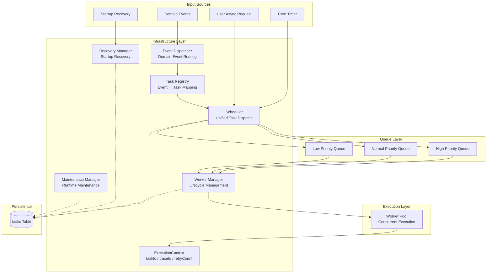
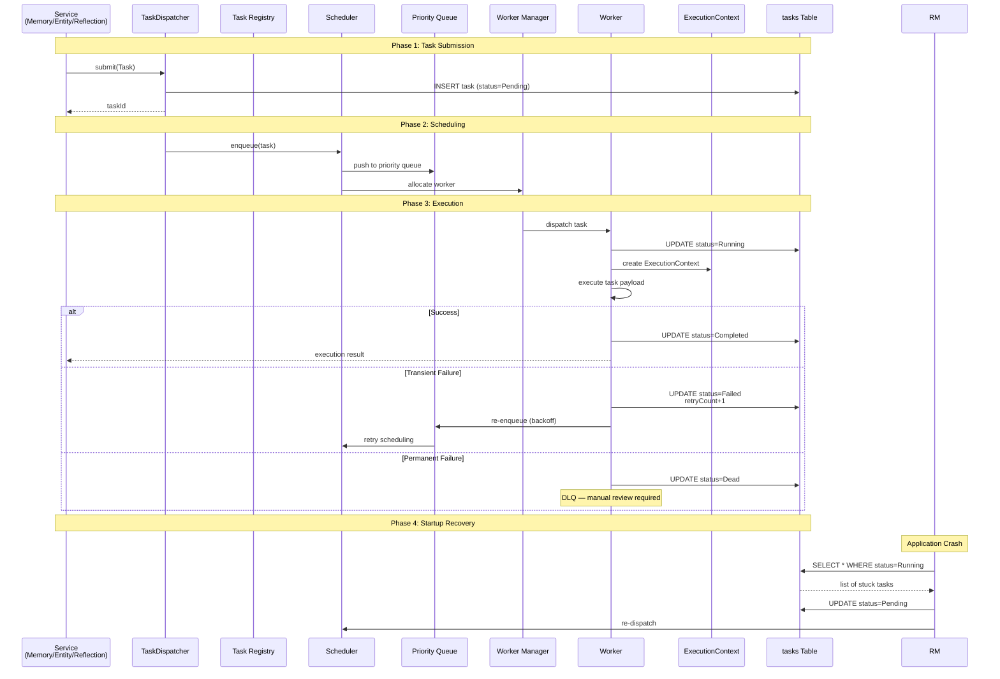

# Personal AI Memory Hub — 10_6 Implementation Task Runtime

> **版本**: 1.0
> **日期**: 2026-06-29
> **阶段**: Phase B — 实现设计（第六部分）
> **状态**: 已确认
> **作者**: 系统架构组

---

## 1. Purpose

本文档定义 **Task Runtime** 的工程实现设计。

Task Runtime 是 Memory Hub 的基础设施层（Infrastructure Layer），负责通用任务的调度、执行、重试、恢复和可观测性。

Task Runtime 是基础设施，不是业务逻辑。

Task Runtime 不理解 Memory、Entity、Reflection 或 Query 等业务概念。

本文档是 Phase B 所有后续 Service 设计的运行时参考基准。

---

## 2. Task Runtime Responsibility

### 2.1 核心定位

> **Task Runtime 是通用任务执行基础设施。**

Task Runtime 负责：

| 职责 | 说明 |
|------|------|
| Task Scheduling | 任务调度 |
| Task Execution | 任务执行 |
| Retry | 失败重试 |
| Recovery | 崩溃恢复 |
| Worker Management | Worker 管理 |
| Queue Management | 队列管理 |
| Runtime Maintenance | 运行时维护 |
| Runtime Observability | 运行时可观测性 |

Task Runtime **不负责**：

| 禁止 | 原因 |
|------|------|
| 业务决策 | 业务决策属于 Service 层 |
| 理解 Payload 内容 | Payload 属于 Task 实现 |
| 执行 Reflection | Reflection 属于 ReflectionService |
| 执行 Memory 管理 | Memory 管理属于 MemoryService |
| 执行 Entity 管理 | Entity 管理属于 EntityService |

### 2.2 明确禁止

Task Runtime **不得**执行以下操作：

| 禁止 | 原因 |
|------|------|
| 理解业务语义 | Task Runtime 是 Domain-Agnostic |
| 执行业务扫描 | Scheduler 只提交 Entry Task，不扫描业务数据 |
| 直接执行业务逻辑 | 业务逻辑属于 Service + Engine |
| 耦合具体技术栈 | 如 Cron、MQ、EventBus 等 |
| 直接调用其他 Service | 违反 Service Independence Principle（G-005） |

### 2.3 正确定位

Task Runtime 是一个通用基础设施，通过抽象 Task 模型和 Domain Events 与业务层解耦。

```
Task Runtime
│
├── Generic Task Abstraction
├── Priority Queue (High / Normal / Low)
├── Retry Policy (Exponential Backoff)
├── Recovery Policy (Startup Recovery)
├── Worker Manager
├── Event Dispatcher
├── Maintenance Manager
└── Observability Layer
```

---

## 3. Task Model

### 3.1 Runtime Metadata

Task Runtime 操作 exclusively on **generic Task abstraction**。

Runtime Metadata 包含：

| 字段 | 类型 | 说明 |
|------|------|------|
| `taskId` | UUID | 任务唯一标识 |
| `taskType` | String | 任务类型（业务定义） |
| `status` | Enum | Pending / Running / Completed / Failed / Dead |
| `priority` | Enum | High / Normal / Low |
| `retryCount` | Int | 当前重试次数 |
| `maxRetry` | Int | 最大重试次数 |
| `createdAt` | Timestamp | 创建时间 |
| `scheduledAt` | Timestamp | 计划执行时间 |
| `startedAt` | Timestamp | 开始执行时间 |
| `completedAt` | Timestamp | 完成时间 |
| `requestedBy` | String | 请求方（Service 名称） |
| `lastErrorCode` | String | 最后错误码 |
| `lastErrorMessage` | String | 最后错误信息 |
| `lastErrorTime` | Timestamp | 最后错误时间 |

### 3.2 Payload 归属

> **Payload 属于 Task 实现，不属于 Runtime。**

| 概念 | 归属 | 说明 |
|------|------|------|
| Runtime Metadata | Task Runtime | 运行时管理的元数据 |
| Payload | Task 实现 | 业务数据，Runtime 不解析 |

Task Runtime 从不解析 Payload。

### 3.3 Domain Agnostic

Task Runtime 不理解以下业务概念：

| 概念 | 归属 |
|------|------|
| Memory | MemoryService / MemoryEngine |
| Entity | EntityService / EntityEngine |
| Reflection | ReflectionService / ReflectionEngine |
| Query | QueryService / RetrievalEngine |

Task Runtime 只理解 `Task` 抽象。

---

## 4. Task Chaining

### 4.1 Final Architecture Decision

> **Task 从不直接创建另一个 Task。Task 从不入队另一个 Task。**

### 4.2 Task Chaining 模型

```
Task
    ↓
Service（业务决策）
    ↓
Domain Event
    ↓
Event Dispatcher
    ↓
Task Registry
    ↓
Task Factory
    ↓
New Task
```

### 4.3 设计原则

| 原则 | 说明 |
|------|------|
| **Service 是决策者** | 业务决策（是否触发新任务）属于 Service |
| **Domain Event 是桥梁** | 业务变更通过 Domain Event 表达 |
| **Event Dispatcher 是路由器** | 将 Domain Event 分发到 Task Registry |
| **Task Registry 是映射表** | 定义 Event → Task 的映射关系 |
| **Task Factory 是创建者** | 根据映射创建具体 Task |

### 4.4 Event → Task 映射模式

| 模式 | 说明 | 示例 |
|------|------|------|
| **One Event → Multiple Tasks** | 一个事件触发多个任务 | `EntityMerged` → `ReferenceMigration` + `IndexRebuild` |
| **Multiple Events → Same Task** | 多个事件触发同一任务 | `ObservationCreated` + `ImportCompleted` → `ReflectionTask` |

---

## 5. Task Lifecycle

### 5.1 Minimal State Machine

```
Pending
    ↓
Running
    ↓
Completed
```

或

```
Pending
    ↓
Running
    ↓
Failed
    ↓
Retry（回到 Pending）
    ↓
...
    ↓
Dead（超过 maxRetry）
```

### 5.2 已移除的状态

| 移除状态 | 原因 |
|----------|------|
| Cancelled | 不支持取消操作 |
| Waiting | 等待由 scheduledAt 处理 |
| Paused | 不支持暂停操作 |
| Blocked | 由优先级队列处理并发 |

### 5.3 状态说明

| 状态 | 说明 |
|------|------|
| **Pending** | 任务已创建，等待调度 |
| **Running** | 任务正在执行 |
| **Completed** | 任务成功完成 |
| **Failed** | 单次执行失败，可能进入 Retry |
| **Dead** | 超过 maxRetry 后放弃，需要人工审查 |

### 5.4 Retry vs Re-trigger

> **Retry 和 Re-trigger 是根本不同的概念。**

| 维度 | Retry | Re-trigger |
|------|-------|------------|
| 本质 | 同一 Task 再次尝试 | 创建全新的 Task |
| 责任方 | Task Runtime | Service / Scheduler / Domain Event |
| 目的 | 技术恢复 | 业务决策 |
| 触发 | 执行失败 | 业务事件 |
| 重试次数 | 受 maxRetry 限制 | 无重试限制 |

---

## 6. Idempotency

### 6.1 Execution Guarantee

> **Task Runtime 提供 At-Least-Once 执行保证。**

| 原则 | 说明 |
|------|------|
| **At-Least-Once** | 任务可能被执行多次（网络抖动、Worker 崩溃等） |
| **Idempotent Task** | 每个 Task 实现应该是幂等的 |
| **Exactly-Once 不需要** | 不追求 Exactly-Once 执行 |

### 6.2 Idempotency 策略

| 策略 | 说明 |
|------|------|
| **Task 幂等键** | Task 实现通过 taskId 或业务键判断是否已执行 |
| **业务层保证** | Service 层确保重复执行的副作用可控 |
| **Runtime 不干预** | Runtime 不解析 Payload，不负责幂等性 |

---

## 7. Scheduler

### 7.1 Final Architecture Decision

> **Scheduler 不是 Cron。Scheduler 是统一的 Task 分发协调器。**

### 7.2 支持的触发源

| 触发源 | 说明 | 示例 |
|--------|------|------|
| **Domain Event** | 业务事件驱动 | `EntityMerged` → 触发 Reference Migration |
| **Scheduler（Cron）** | 定时触发 | 每日 Reflection、每月 Archive |
| **Startup Recovery** | 启动恢复 | 崩溃的 Running Task 恢复为 Pending |
| **Future User Async Request** | 用户异步请求 | 用户手动触发 Reflection |

### 7.3 Scheduler 职责边界

| 职责 | 说明 |
|------|------|
| ✅ 提交 Entry Task | 将任务放入调度队列 |
| ✅ 优先级管理 | High / Normal / Low |
| ✅ 定时调度 | Cron 驱动的任务提交 |
| ❌ 业务扫描 | 不主动扫描业务数据 |
| ❌ 业务决策 | 不决定"做什么"，只决定"何时做" |

### 7.4 优先级策略

> **使用 Priority Queue 支持 High / Normal / Low 优先级。**

| 策略 | 说明 |
|------|------|
| **Reserved Execution Capacity** | 架构描述预留执行容量 |
| **MVP 实现建议** | 保留一个 Worker 执行槽给 High Priority 任务 |
| **Architecture 不硬编码** | 不硬编码 Worker 数量 |

---

## 8. Domain Event Consumption

### 8.1 Event Dispatcher

```
Domain Event
    ↓
Event Dispatcher
    ↓
Task Registry
    ↓
Task Factory
    ↓
Task
    ↓
Scheduler
```

### 8.2 运行时语义

| 原则 | 说明 |
|------|------|
| **Runtime 从不解释领域语义** | Event Dispatcher 只做路由，不解包业务含义 |
| **Task Registry 支持多对多** | One Event → Multiple Tasks / Multiple Events → Same Task |
| **Task Factory 创建实例** | 根据 Task Registry 映射创建具体 Task |

### 8.3 Task Registry

Task Registry 维护 Event → Task 类型的映射关系：

| 映射类型 | 说明 | 示例 |
|----------|------|------|
| **One Event → Multiple Tasks** | 一个事件触发多种任务 | `EntityMerged` → `ReferenceMigration` + `IndexRebuild` |
| **Multiple Events → Same Task** | 多种事件触发同一任务 | `ObservationCreated` + `ImportCompleted` → `ReflectionTask` |

---

## 9. Retry / Recovery

### 9.1 失败分类

| 失败类型 | 说明 | 处理方式 |
|----------|------|----------|
| **Transient Failure** | 临时故障（网络超时、DB 锁） | 自动 Retry（指数退避） |
| **Permanent Failure** | 永久故障（业务校验失败） | 直接标记 Dead，不 Retry |
| **Runtime Crash** | 运行时崩溃（Worker 宕机） | Startup Recovery 重新调度 |

### 9.2 Retry 策略

| 参数 | 说明 |
|------|------|
| **Exponential Backoff** | 重试间隔指数增长 |
| **maxRetry** | 每个 Task 定义最大重试次数 |
| **Dead Letter** | 超过 maxRetry 后标记为 Dead |

### 9.3 Startup Recovery

```
Application Startup
    ↓
Scan tasks WHERE status = 'Running' AND startedAt < threshold
    ↓
Set status = 'Pending'
    ↓
Re-dispatch to Scheduler
```

### 9.4 Recovery 原则

> **Recovery 从不重新评估业务逻辑。Recovery 只恢复执行。**

| 原则 | 说明 |
|------|------|
| **不重新评估** | 恢复时不重新计算业务决策 |
| **只恢复执行** | 将 Pending 状态的 Task 重新入队 |
| **幂等保障** | 依靠 Task 幂等性保证安全 |

---

## 10. Background Maintenance

### 10.1 Maintenance Manager

> **Maintenance Manager 是 Runtime 基础设施的清洁工。**

Maintenance Manager 仅负责 Runtime 维护：

| 职责 | 说明 |
|------|------|
| Task Cleanup | 清理 Completed / Dead 任务记录 |
| Lock Cleanup | 清理过期的分布式锁 |
| Runtime Statistics | 收集运行时统计数据 |
| Runtime Health | 监控运行时健康状态 |
| Log Retention Policy | 日志保留策略执行 |
| Runtime Metadata Cleanup | 运行时元数据清理 |

### 10.2 明确禁止

Maintenance Manager **不得**执行：

| 禁止 | 原因 |
|------|------|
| Reflection | 属于 ReflectionService |
| Memory Maintenance | 属于 MemoryService |
| Entity Maintenance | 属于 EntityService |
| 任何业务维护 | 业务维护属于 Service 层 |

### 10.3 业务维护归属

| 维护类型 | 归属 |
|----------|------|
| Reference Migration | EntityService（通过 Task Runtime 异步执行） |
| Graph Maintenance | EntityService（通过 Task Runtime 异步执行） |
| Reflection | ReflectionService |
| Memory Archive | MemoryService |

---

## 11. Runtime Architecture

### 11.1 Runtime 组件

Task Runtime 由以下组件构成：

```
Task Runtime
│
├── Scheduler          — 统一任务分发协调器
├── Worker Manager     — Worker 生命周期管理
├── Event Dispatcher   — Domain Event 路由
├── Recovery Manager   — 启动恢复管理
├── Maintenance Manager— Runtime 维护
├── Task Registry      — Event → Task 映射
└── ExecutionContext   — 执行上下文
```

### 11.2 ExecutionContext

ExecutionContext 包含运行时元数据和执行信息：

| 字段 | 类型 | 说明 |
|------|------|------|
| `taskId` | UUID | 当前任务 ID |
| `traceId` | UUID | 追踪 ID（跨任务链） |
| `retryCount` | Int | 当前重试次数 |
| `requestedBy` | String | 请求方 |
| `startedAt` | Timestamp | 开始时间 |
| `workerId` | String | 执行 Worker |
| `priority` | Enum | 优先级 |

### 11.3 组件交互

```
                    ┌─────────────┐
                    │   Scheduler  │
                    └──────┬──────┘
                           │
              ┌────────────┼────────────┐
              ▼            ▼            ▼
        ┌──────────┐ ┌──────────┐ ┌──────────┐
        │  Domain   │ │  Cron    │ │ Startup  │
        │  Events   │ │  Timer   │ │ Recovery │
        └────┬───────┘ └────┬─────┘ └────┬─────┘
             │              │            │
             └──────────────┼────────────┘
                            ▼
                     ┌──────────┐
                     │ Priority │
                     │  Queue   │
                     └────┬─────┘
                          ▼
                   ┌──────────┐
                   │ Worker   │
                   │ Manager  │
                   └────┬─────┘
                        ▼
                  ┌──────────┐
                  │ ExecutionContext │
                  └──────────────────┘
```

---

## 12. Interfaces

### 12.1 Operational Interfaces

Task Runtime 仅暴露操作接口，不暴露业务接口：

| 方法 | 参数 | 返回 | 说明 |
|------|------|------|------|
| `submit(Task)` | Task | `taskId` | 提交任务 |
| `getTask(taskId)` | taskId | `Task` | 查询任务状态 |
| `queryRuntimeStatus()` | — | `RuntimeStatus` | 查询运行时状态 |
| `retry(taskId)` | taskId | `taskId` | 手动重试任务 |

### 12.2 权限执行

| 原则 | 说明 |
|------|------|
| **权限在 Runtime 之外** | 权限校验属于 Service / Entry 层 |
| **手动执行是操作能力** | 不是业务接口 |
| **个人版天然拥有操作权限** | 不需要额外权限模型 |

### 12.3 Forbidden Interfaces

Task Runtime **不暴露**以下接口：

| 禁止 | 原因 |
|------|------|
| `executeReflection(scope)` | 业务接口，不属于 Runtime |
| `processMemoryBatch(ids)` | 业务接口 |
| `mergeEntities(ids)` | 业务接口 |
| 任何理解 Payload 内容的接口 | Runtime 是 Domain-Agnostic |

---

## 13. Observability

### 13.1 分层架构

> **Runtime Metadata、Logging、Metrics、Dashboard 是分层独立的。**

| 层级 | 职责 | 归属 |
|------|------|------|
| **Runtime Metadata** | 任务元数据（taskId、status、priority、retryCount） | Task Runtime |
| **Logging** | 操作日志 | Runtime Infrastructure |
| **Metrics** | 性能指标（吞吐量、延迟、失败率） | Runtime Infrastructure |
| **Dashboard** | 可视化展示 | 外部系统，非 Runtime |

### 13.2 Maintenance Manager 与 Log Retention

| 原则 | 说明 |
|------|------|
| **Maintenance Manager 执行保留策略** | 按策略清理日志 |
| **Dashboard 消费运行时信息** | Dashboard 是消费者，不是 Runtime |
| **Dashboard 不是 Runtime 的一部分** | 清晰分离基础设施和业务展示 |

### 13.3 可观测性数据

| 数据类型 | 说明 | 用途 |
|----------|------|------|
| **Runtime Metadata** | taskId、status、priority、retryCount、traceId | 任务追踪 |
| **Execution Log** | 任务执行日志 | 故障排查 |
| **Performance Metrics** | 执行时间、成功率、失败率 | 性能监控 |
| **Health Check** | Worker 数量、队列长度、活跃任务数 | 健康监控 |

---

## 14. Service Collaboration

### 14.1 Service → Runtime 交互

| Service | 交互模式 | 说明 |
|---------|----------|------|
| **MemoryService** | submit / query | 提交 Import Job、Reflection Task；查询状态 |
| **EntityService** | submit / query | 提交 Reference Migration Task；查询状态 |
| **ReflectionService** | submit / query | 提交 Reflection Task；查询状态 |
| **QueryService** | ❌ 不调用 | QueryService 是读接口，不触发任务 |

### 14.2 Domain Event → Task 映射

| Domain Event | Task Type | 触发 Service |
|-------------|-----------|-------------|
| `ObservationCreated` | `REFLECTION_TASK` | IngestionService |
| `ImportCompleted` | `REFLECTION_TASK` | MemoryService |
| `EntityMerged` | `REFERENCE_MIGRATION_TASK` | EntityService |
| `EntityMerged` | `INDEX_REBUILD_TASK` | EntityService |
| `MemoryArchived` | `ARCHIVE_TASK` | MemoryService |
| `BeliefUpdated` | `ACTIVATION_TASK` | ReflectionService |

### 14.3 Forbidden Dependencies

| Forbidden | Reason |
|-----------|--------|
| Task Runtime → MemoryService | Service Independence Principle (G-005) |
| Task Runtime → EntityService | Service Independence Principle (G-005) |
| Task Runtime → ReflectionService | Service Independence Principle (G-005) |
| Task Runtime → 理解 Payload | Task Runtime 是 Domain-Agnostic |

---

## 15. Consistency Principles

### 15.1 Infrastructure Isolation

> **Task Runtime 是纯基础设施层，与业务逻辑完全隔离。**

| 原则 | 说明 |
|------|------|
| **Domain Agnostic** | Runtime 不理解任何业务概念 |
| **Generic Task Model** | 所有业务通过统一 Task 抽象表达 |
| **Event-Driven Chaining** | 业务链通过 Domain Event + Task Registry 实现 |
| **Separation of Concerns** | 基础设施关注执行，Service 关注业务 |

### 15.2 Error Handling

| 原则 | 说明 |
|------|------|
| **Transient → Retry** | 临时故障自动重试 |
| **Permanent → Dead** | 永久故障标记 Dead，人工审查 |
| **Crash → Recovery** | 崩溃后启动恢复 |
| **Never Re-evaluate** | Recovery 不重新评估业务逻辑 |

### 15.3 Concurrency Control

| 原则 | 说明 |
|------|------|
| **Priority Queue** | High / Normal / Low 优先级队列 |
| **Reserved Capacity** | 为 High Priority 预留执行槽 |
| **Worker Pool** | 可配置 Worker 数量 |
| **No Blocking** | 不阻塞高优先级任务 |

---

## 16. Future Evolution

### 16.1 Planned Evolution

| 方向 | 说明 |
|------|------|
| **Distributed Worker Scaling** | Worker 水平扩展能力 |
| **Task Dependency Graph** | 复杂任务依赖关系管理 |

### 16.2 Potential Evolution

| 方向 | 说明 |
|------|------|
| **Task Pipeline** | 支持多阶段 Task Pipeline |
| **Dynamic Priority Adjustment** | 运行时动态调整任务优先级 |
| **Task Isolation** | 不同业务域的 Task 隔离执行 |

> **以上为 Future Architecture Exploration，MVP 不实现，不指定具体实现方式。**

---

## 17. Checklist

### 17.1 P0 — 必须完成

| # | 检查项 | 状态 |
|---|--------|------|
| P0-1 | **Side-Effect Free Query** | Task Runtime 是执行基础设施，不涉及查询 |
| P0-2 | **Service → Service 检查** | Task Runtime 不依赖任何 Service |
| P0-3 | **Engine DAG 清晰** | Task Runtime 不编排 Engine |
| P0-4 | **Service DAG 无循环** | Task Runtime 不依赖其他 Service |
| P0-5 | **Consumer-Agnostic Interface** | Public API 面向操作，不面向业务 |
| P0-6 | **Public API Family** | submit()/getTask()/queryRuntimeStatus()/retry() |
| P0-7 | **Service Independence** | 不调用 MemoryService / EntityService / ReflectionService |
| P0-8 | **Domain Agnostic** | 不理解 Memory / Entity / Reflection / Query |
| P0-9 | **Task Chaining via Events** | 通过 Domain Event + Task Registry 实现链式调用 |
| P0-10 | **Minimal Lifecycle** | Pending → Running → Completed / Failed → Retry → Dead |
| P0-11 | **At-Least-Once Execution** | 提供幂等保障，不追求 Exactly-Once |
| P0-12 | **Recovery Never Re-evaluates** | 启动恢复只恢复执行，不重新评估业务逻辑 |

### 17.2 P1 — 推荐实现

| # | 检查项 | 状态 |
|---|--------|------|
| P1-1 | **Priority Queue (High/Normal/Low)** | 支持优先级调度 |
| P1-2 | **Exponential Backoff Retry** | 失败重试指数退避 |
| P1-3 | **Runtime Observability** | 元数据、日志、指标分层 |
| P1-4 | **Maintenance Manager** | 自动清理 Completed/Dead 任务 |

### 17.3 P2 — 未来演进

| # | 检查项 | 状态 |
|---|--------|------|
| P2-1 | **Distributed Worker Scaling** | Worker 水平扩展 |
| P2-2 | **Task Dependency Graph** | 复杂任务依赖 |
| P2-3 | **Task Pipeline** | 多阶段 Task Pipeline |

---

## 18. Decision Summary

| # | 决策 | 说明 | 来源 |
|---|------|------|------|
| 1 | **Task Runtime = Infrastructure** | 基础设施不是业务逻辑 | 10_6 §2.1 |
| 2 | **Generic Task Abstraction** | Runtime 操作通用 Task，不理解业务 | 10_6 §3 |
| 3 | **Runtime Metadata Only** | taskId / taskType / status / priority / retryCount | 10_6 §3.1 |
| 4 | **Payload Belongs to Implementation** | Runtime 从不解析 Payload | 10_6 §3.2 |
| 5 | **Domain Agnostic** | 不理解 Memory / Entity / Reflection / Query | 10_6 §3.3 |
| 6 | **Task Chaining via Events** | Task → Service → Domain Event → Task Registry → New Task | 10_6 §4 |
| 7 | **No Direct Task Creation** | Task 从不直接创建另一个 Task | 10_6 §4.1 |
| 8 | **Event → Task Mapping Patterns** | One Event → Multiple Tasks / Multiple Events → Same Task | 10_6 §4.4 |
| 9 | **Minimal Lifecycle** | Pending → Running → Completed / Failed → Retry → Dead | 10_6 §5 |
| 10 | **Retry vs Re-trigger Distinction** | Retry = 同一 Task / Re-trigger = 新 Task | 10_6 §5.4 |
| 11 | **At-Least-Once Execution** | 不追求 Exactly-Once，Task 实现应幂等 | 10_6 §6 |
| 12 | **Scheduler ≠ Cron** | Scheduler 是统一 Task 分发协调器 | 10_6 §7.1 |
| 13 | **Four Trigger Sources** | Domain Event / Cron / Startup Recovery / User Async | 10_6 §7.2 |
| 14 | **Priority Queue** | High / Normal / Low | 10_6 §7.4 |
| 15 | **Reserved Execution Capacity** | 架构描述预留容量，不硬编码 Worker 数量 | 10_6 §7.4 |
| 16 | **Event Dispatcher Pattern** | Domain Event → Dispatcher → Registry → Factory → Task | 10_6 §8 |
| 17 | **Runtime Never Interprets Semantics** | Event Dispatcher 只做路由 | 10_6 §8.2 |
| 18 | **Three Failure Categories** | Transient / Permanent / Runtime Crash | 10_6 §9.1 |
| 19 | **Exponential Backoff** | 重试间隔指数增长 | 10_6 §9.2 |
| 20 | **Startup Recovery** | Running → Pending → Re-dispatch | 10_6 §9.3 |
| 21 | **Recovery Never Re-evaluates** | 只恢复执行，不重新评估业务逻辑 | 10_6 §9.4 |
| 22 | **Maintenance Manager Scope** | 仅 Runtime 维护，不涉业务 | 10_6 §10.1 |
| 23 | **Six Runtime Components** | Scheduler / Worker Manager / Event Dispatcher / Recovery Manager / Maintenance Manager / Task Registry | 10_6 §11.1 |
| 24 | **ExecutionContext** | 包含 taskId / traceId / retryCount / requestedBy | 10_6 §11.2 |
| 25 | **Operational Interfaces Only** | submit / getTask / queryRuntimeStatus / retry | 10_6 §12.1 |
| 26 | **Observability Layering** | Runtime Metadata / Logging / Metrics / Dashboard 分层 | 10_6 §13 |
| 27 | **Infrastructure Isolation** | Runtime 与业务逻辑完全隔离 | 10_6 §15.1 |
| 28 | **Manual Execution is Operational** | 不是业务接口 | 10_6 §12.2 |

---

## 19. Appendix A: Runtime Sequence Examples

### Example 1: User-Triggered Async Task

```
User Request (REST/MCP/CLI)
    ↓
Service (业务决策)
    ↓
submit(Task)
    ↓
Task Registry (创建 Task 记录)
    ↓
Scheduler (入队)
    ↓
Worker Manager (分配 Worker)
    ↓
Task Execution
    ↓
Completed / Failed → Retry / Dead
```

### Example 2: Entity Merge → Reference Migration

```
EntityService.mergeEntities(id1, id2)
    ↓
EntityEngine.merge()
    ↓
Persist Merge Result
    ↓
Publish Domain Event: EntityMerged
    ↓
Event Dispatcher
    ↓
Task Registry (EntityMerged → ReferenceMigrationTask + IndexRebuildTask)
    ↓
Task Factory 创建两个 Task
    ↓
Scheduler 入队
    ↓
Worker Manager 执行
    ↓
Reference Migration 完成
    ↓
Index Rebuild 完成
```

### Example 3: L1 → L2 → L3 Reflection Chain (Task Chaining)

```
Observation Created (L1)
    ↓
Publish Domain Event: ObservationCreated
    ↓
Event Dispatcher → Task Registry
    ↓
Task Factory 创建 ReflectionTask(L1)
    ↓
Worker 执行 → L1 Reflection 完成
    ↓
Publish Domain Event: L1MemoryCreated
    ↓
Event Dispatcher → Task Registry
    ↓
Task Factory 创建 ReflectionTask(L2)
    ↓
Worker 执行 → L2 Reflection 完成
    ↓
Publish Domain Event: L2MemoryCreated
    ↓
Event Dispatcher → Task Registry
    ↓
Task Factory 创建 ReflectionTask(L3)
    ↓
Worker 执行 → L3 Reflection 完成
```

### Example 4: LLM Timeout → Retry → Completed

```
Task Execution (LLM Call)
    ↓
Timeout (Transient Failure)
    ↓
Retry Count + 1
    ↓
Exponential Backoff Wait
    ↓
Retry Task Execution
    ↓
Success → Completed
```

### Example 5: Application Crash → Startup Recovery → Completed

```
Application Crash
    ↓
Running Tasks 标记为 Running (DB 中)
    ↓
Application Restart
    ↓
Recovery Manager 扫描 tasks WHERE status = 'Running'
    ↓
Set status = 'Pending'
    ↓
Re-dispatch to Scheduler
    ↓
Worker 拾取并执行
    ↓
Completed
```

---

## 20. Design Validation

### Example → Architecture Principles Mapping

| Example | Architecture Principle Validated |
|---------|----------------------------------|
| **Example 1: User-Triggered Async Task** | Task Runtime 是基础设施，Service 是决策者（§2.1） |
| **Example 2: Entity Merge → Reference Migration** | Task Chaining via Events（§4），Runtime 不理解业务语义（§3.3） |
| **Example 3: L1 → L2 → L3 Reflection Chain** | One Event → Multiple Tasks（§4.4），Task 幂等性（§6） |
| **Example 4: LLM Timeout → Retry → Completed** | Transient Failure → Retry（§9.1），Exponential Backoff（§9.2） |
| **Example 5: Application Crash → Startup Recovery** | Recovery Never Re-evaluates（§9.4），At-Least-Once（§6.1） |

### Validation Summary

| 原则 | 验证方式 | 结果 |
|------|----------|------|
| **Task Runtime 是基础设施** | Example 1: Service 决策，Runtime 执行 | ✅ 通过 |
| **Domain Agnostic** | Example 2: Runtime 不理解 Entity / Merge | ✅ 通过 |
| **Task Chaining via Events** | Example 2, 3: 通过 Domain Event 链式触发 | ✅ 通过 |
| **Minimal Lifecycle** | Example 4: Failed → Retry → Completed | ✅ 通过 |
| **Retry vs Re-trigger** | Example 3: L1→L2 是 Re-trigger（新 Task），Example 4: Timeout 是 Retry（同一 Task） | ✅ 通过 |
| **At-Least-Once Execution** | Example 5: Crash 后 Recovery 重新执行 | ✅ 通过 |
| **Recovery Never Re-evaluates** | Example 5: 只恢复执行，不重新评估业务逻辑 | ✅ 通过 |
| **Infrastructure Isolation** | Example 1~5: Runtime 不涉及任何业务逻辑 | ✅ 通过 |

---

## 21. Backport Updates

完成 10_6 后，需要同步更新以下文档：

| 文档 | 更新内容 |
|------|----------|
| **10_1_Implementation_Service_Layer** | 补充 TaskService 到 Service 清单、Task Runtime 到 Service DAG |
| **10_2_Implementation_MemoryService** | 补充 TaskRuntime 与 MemoryService 的 Job Dispatch 关系 |
| **10_4_Implementation_ReflectionService** | 补充 TaskRuntime 与 ReflectionService 的集成（Reflection Task） |
| **10_5_Implementation_EntityService** | 补充 TaskRuntime 与 EntityService 的集成（Reference Migration Task） |
| **13_Architecture_Guidelines** | 新增 Task Runtime 相关 Guideline |

---

## 21. Architecture Diagrams

### Diagram A: Task Runtime Static Architecture



### Diagram B: Task Runtime Dynamic Execution Flow



---

## 22. Version Record

| 版本 | 日期 | 变更 | 状态 |
|------|------|------|------|
| 1.0 | 2026-06-29 | 初始版本，确认 Task Runtime 全部设计要素 | ✅ 已确认 |

---

*本文档仅记录已达成共识的设计决策，未涉及的内容不在本文档范围内。*

*本文档继承 Phase B 所有已确立的架构原则（Service Independence、Shared Domain Engine、Command/Query Separation、One Capability One Implementation）。*
